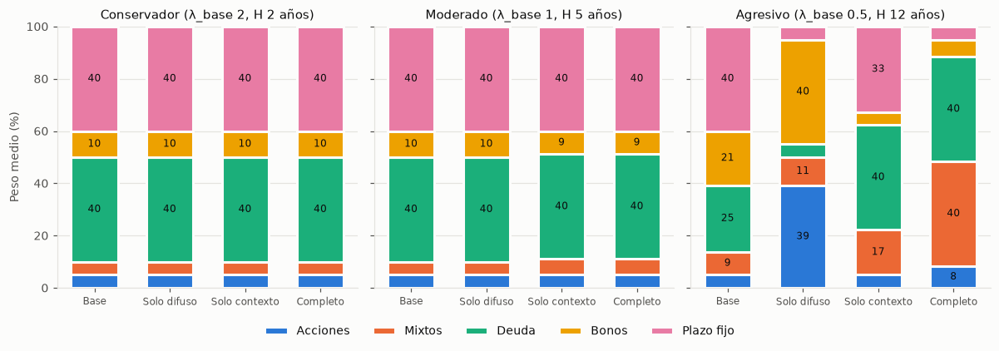
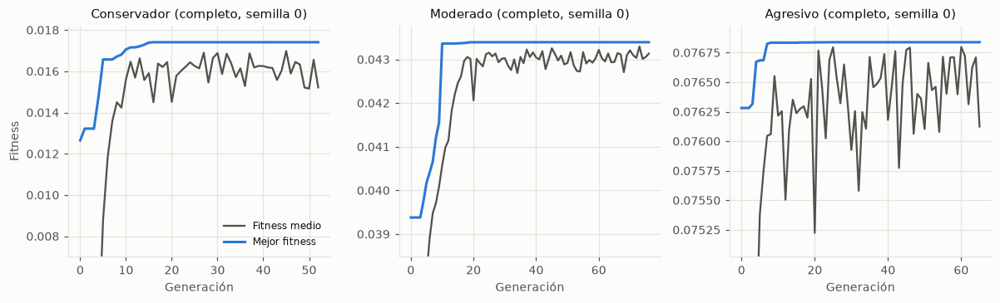

# 01 · Ablación

## Método

- Cuatro configuraciones del modelo, con los interruptores de `recommend` (`Switches`):

| Configuración | Difuso | Contexto | Qué se apaga |
|---|---|---|---|
| Base | Off | Off | m_H = 1 (λ_ef = λ_base), sin penalización de volatilidad ni recompensa κ; sin ajuste de contexto |
| Solo difuso | On | Off | Sin ajuste de contexto (c_ctx = 0, σ' = σ) |
| Solo contexto | Off | On | Igual que la base en lo difuso |
| Completo | On | On | Nada |

- Tres arquetipos (conservador, moderado, agresivo; ver el [índice](README.md#configuración-común)) × 10 semillas = 120 corridas.
- Las configuraciones con contexto usan un panorama levemente adverso (político −0.5, macro 0) para que su efecto sea visible; la tendencia de mercado es la de los datos (W14: acciones +1, mixtos +1, deuda +0.87, bonos −0.46, plazo fijo −0.18; mixtos = 0.5 × acciones + 0.5 × bonos).
- Métricas: pesos por categoría, retorno esperado E (incluye el ajuste de contexto), volatilidad σ, fitness, índice de Herfindahl (HHI = Σwᵢ²; 0.2 es reparto uniforme, 1 es una sola categoría), `c`, μ_CA(c), centroide, λ_ef y generaciones hasta converger.
- Datos: `experiments/results/ablation_runs.csv` y `ablation_summary.csv`.

## Resultados

Media ± desviación estándar entre semillas. Pesos, E y σ en %. Con el difuso apagado `c` no interviene en el fitness (su valor es aleatorio) y μ_CA(c) no aplica (n/d).

| Arquetipo | Configuración | Acciones | Mixtos | Deuda | Bonos | Plazo fijo | E | σ | Fitness | HHI | c | μ_CA(c) | Centroide | λ_ef | Gen. |
|---|---|---|---|---|---|---|---|---|---|---|---|---|---|---|---|
| Conservador | Base | 1.0 | 0.0 | 40.0 | 19.0 | 40.0 | 4.5 | 1.5 | 0.0159 | 0.356 | 0.455 ± 0.206 | n/d | 0.157 | 2.000 | 45.7 ± 2.8 |
| Conservador | Solo difuso | 0.6 | 0.0 | 40.0 | 19.4 | 40.0 | 4.5 | 1.5 | 0.0247 | 0.358 | 0.068 ± 0.038 | 0.778 | 0.157 | 3.000 | 50.4 ± 5.2 |
| Conservador | Solo contexto | 0.6 | 0.0 | 40.0 | 19.4 | 40.0 | 4.5 | 1.6 | 0.0131 | 0.358 | 0.454 ± 0.280 | n/d | 0.157 | 2.000 | 53.0 ± 15.4 |
| Conservador | Completo | 0.0 | 0.8 | 40.0 | 19.2 | 40.0 | 4.5 | 1.6 | 0.0206 | 0.357 | 0.085 ± 0.038 | 0.778 | 0.157 | 3.000 | 49.0 ± 7.0 |
| Moderado | Base | 2.0 | 0.0 | 40.0 | 18.0 | 40.0 | 4.6 | 1.5 | 0.0307 | 0.353 | 0.533 ± 0.229 | n/d | 0.731 | 1.000 | 47.7 ± 5.1 |
| Moderado | Solo difuso | 2.0 | 0.0 | 40.0 | 18.0 | 40.0 | 4.6 | 1.5 | 0.0457 | 0.353 | 0.917 ± 0.056 | 0.500 | 0.731 | 1.000 | 52.3 ± 7.9 |
| Moderado | Solo contexto | 1.5 | 0.0 | 40.0 | 18.5 | 40.0 | 4.6 | 1.6 | 0.0292 | 0.354 | 0.528 ± 0.267 | n/d | 0.731 | 1.000 | 50.4 ± 9.0 |
| Moderado | Completo | 1.5 | 0.0 | 40.0 | 18.5 | 40.0 | 4.6 | 1.6 | 0.0442 | 0.354 | 0.870 ± 0.059 | 0.500 | 0.731 | 1.000 | 49.0 ± 11.2 |
| Agresivo | Base | 4.6 | 0.0 | 40.0 | 15.4 | 40.0 | 4.7 | 1.7 | 0.0385 | 0.346 | 0.440 ± 0.222 | n/d | 0.853 | 0.500 | 103.7 ± 30.5 |
| Agresivo | Solo difuso | 40.0 | 0.0 | 0.0 | 40.0 | 20.0 | 8.1 | 9.8 | 0.0768 | 0.360 | 0.944 ± 0.044 | 1.000 | 0.853 | 0.350 | 46.5 ± 7.4 |
| Agresivo | Solo contexto | 3.8 | 0.0 | 40.0 | 16.2 | 40.0 | 4.7 | 1.9 | 0.0378 | 0.348 | 0.511 ± 0.274 | n/d | 0.853 | 0.500 | 51.9 ± 11.5 |
| Agresivo | Completo | 7.7 | 0.0 | 40.0 | 12.3 | 40.0 | 5.0 | 2.6 | 0.0710 | 0.341 | 0.965 ± 0.019 | 1.000 | 0.853 | 0.350 | 89.7 ± 25.7 |

Los pesos, E, σ, fitness y HHI tienen desviación 0.0 entre semillas (en los pesos, menor que 0.01 pp; en el fitness, menor que 10⁻⁸) en las 12 celdas (el AG converge al mismo portafolio con las 10 semillas); por eso se omite el ± en esas columnas. Todas las corridas terminaron por convergencia (25 generaciones sin mejora), antes del máximo de 200 (la más larga, 146).

## Interpretación (para el informe, sección 9.x)

**Horizonte difuso.** Es el componente con mayor efecto sobre los pesos, pero ahora solo se ve en el agresivo. El horizonte largo (H = 12 años, m_H = 0.7) baja la aversión efectiva de 0.5 a 0.35 y el portafolio pasa de 4.6 % a 40.0 % en acciones, con deuda de 40.0 % a 0 % (E de 4.7 % a 8.1 %, σ de 1.7 % a 9.8 %). En el conservador, el horizonte corto (H = 2, m_H = 1.5) sube λ_ef de 2 a 3, pero el portafolio ya está en su forma más prudente (deuda y plazo fijo en el tope): acciones baja de 1.0 % a 0.6 % y bonos sube de 19.0 % a 19.4 %. En el moderado (H = 5, pertenencia total a "mediano", m_H = 1) el difuso no cambia los pesos, que es el comportamiento esperado.

**Absorción en el cromosoma.** En los tres arquetipos la penalización de volatilidad nunca se activa: σ del portafolio (1.5 % a 9.8 %) queda por debajo de σ_max(c) (3.9 % a 15.5 %). La absorción solo aporta la recompensa κ·μ_CA(c), que eleva el fitness pero no cambia los pesos; el gen `c` se ubica en la meseta de máxima pertenencia de μ_CA (0.870 a 0.965 en moderado y agresivo; 0.068 a 0.085 en el conservador, por debajo de su centroide 0.157). El caso en que la absorción sí recorta el riesgo se analiza en [03 · Gen difuso](03-gen-difuso.md).

**Contexto.** El ajuste de contexto suma dos efectos: el panorama (político −0.5) y la tendencia de los datos (RC6, β_tend = 1.5 pp por unidad de `s_tend`). En el agresivo completo las acciones bajan de 40.0 % (solo difuso) a 7.7 % y el plazo fijo sube de 20.0 % a 40.0 %. En los perfiles prudentes el efecto es pequeño porque el 20 % libre ya es casi todo bonos: acciones baja de 2.0 % a 1.5 % en el moderado y de 1.0 % a 0.6 % en el conservador (base frente a solo contexto). El retorno esperado incluye esta corrección.

**Convergencia y estabilidad.** El AG converge en 46 a 104 generaciones de media y produce el mismo portafolio con las 10 semillas, lo que indica que el óptimo es estable para estos casos. El agresivo base es el más lento (103.7 ± 30.5).

## Qué cambió con datos reales (W14)

| Arquetipo · configuración | Antes: acciones / mixtos / deuda / bonos / plazo fijo (%) | Con series del BCRP (%) |
|---|---|---|
| Conservador · base | 0.0 / 0.3 / 19.7 / 40.0 / 40.0 | 1.0 / 0.0 / 40.0 / 19.0 / 40.0 |
| Conservador · completo | 0.0 / 0.0 / 31.7 / 28.3 / 40.0 | 0.0 / 0.8 / 40.0 / 19.2 / 40.0 |
| Moderado · base | 1.7 / 4.8 / 13.5 / 40.0 / 40.0 | 2.0 / 0.0 / 40.0 / 18.0 / 40.0 |
| Moderado · completo | 0.8 / 2.8 / 16.4 / 40.0 / 40.0 | 1.5 / 0.0 / 40.0 / 18.5 / 40.0 |
| Agresivo · base | 9.9 / 10.1 / 0.0 / 40.0 / 40.0 | 4.6 / 0.0 / 40.0 / 15.4 / 40.0 |
| Agresivo · solo difuso | 40.0 / 20.0 / 0.0 / 40.0 / 0.0 | 40.0 / 0.0 / 0.0 / 40.0 / 20.0 |
| Agresivo · completo | 16.0 / 4.0 / 0.0 / 40.0 / 40.0 | 7.7 / 0.0 / 40.0 / 12.3 / 40.0 |

- **Deuda reemplaza a bonos en el tope.** Con datos, la deuda de corto plazo tiene μ 3.7 % y σ 0.6 % (Anexo A: 2.4 % y 2.5 %) y los bonos σ 6.5 % (Anexo A: 3.5 %). La deuda pasa a dominar la relación retorno/riesgo de los perfiles prudentes.
- **Menos retorno esperado y menos σ** en conservador y moderado (E 4.5–4.6 % frente a 4.1–5.2 %; σ 1.5–1.6 % frente a 1.6–1.9 %).
- **Los mixtos casi desaparecen** (antes hasta 20 %; ahora a lo sumo 0.8 %): el compuesto 0.5 × acciones + 0.5 × bonos es una combinación de dos categorías que el AG ya elige por separado.
- **Las conclusiones cualitativas se mantienen:** el horizonte domina en el agresivo, el contexto adverso reduce acciones, la absorción no actúa en los arquetipos estándar y el tope impone la diversificación.

## Limitaciones observadas

- **Concentración por el tope.** En 11 de las 12 celdas deuda y plazo fijo quedan exactamente en el tope de 40 %; en la restante (agresivo con solo difuso) lo alcanzan acciones y bonos. El HHI se mantiene entre 0.340 y 0.360. La diversificación la impone el tope (decisión D2), no el modelo de riesgo: deuda (σ 0.6 %) y plazo fijo (σ 0.4 %) dominan la relación retorno/riesgo de los datos. Su σ es baja porque ambas series son tasas (la variación medida es la del nivel de tasa, no un riesgo de pérdida).
- **Fondos mixtos compuestos.** Su serie es 0.5 × acciones + 0.5 × bonos (el BCRP no publica retornos de fondos mutuos). Como el AG puede armar esa mezcla con acciones y bonos directamente, los mixtos solo se eligen cuando el ajuste de contexto los favorece frente a sus componentes; en la ablación quedan entre 0 % y 0.8 %.
- **El componente de absorción no mueve los pesos en estos arquetipos**: su efecto queda en `c` y en el fitness. Es un resultado honesto del diseño: la restricción difusa solo actúa cuando el perfil pide más volatilidad de la que la capacidad permite.
- **`c` atascado en una zona sin pertenencia (corregido).** En la primera versión del experimento, en el conservador con semilla 7 (solo difuso y completo), el AG terminó con c = 0.759 y μ_CA(c) = 0: μ_CA de absorción baja es 0 en todo [0.4, 1], esa región es plana para el fitness y la mutación de `c` (σ 0.10) no sacaba al gen de ahí antes de agotar la paciencia. Los pesos no cambiaban, pero el `c` mostrado no era representativo (desviación 0.246 en μ_CA(c) y 0.0074 en el fitness). Se corrigió de dos formas: con el difuso activo, los `c` iniciales se muestrean del conjunto de absorción (probabilidad proporcional a μ_CA en la rejilla) y la mutación de `c` usa su propio σ (`c_mutation_sigma` = 0.15 en `data/parameters/optimization.json`). Tras la corrección ninguna de las 600 corridas de los cuatro experimentos termina con μ_CA(c) = 0 (mínimo 0.5) y el conservador queda con μ_CA(c) = 0.778 en las 10 semillas; hay pruebas de regresión en `tests/unit/test_ga_algorithm.py`.
