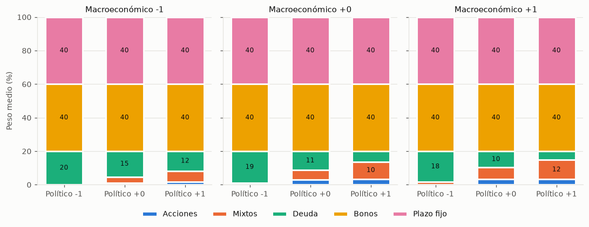

# 02 · Escenarios de contexto

## Método

- Arquetipo moderado (λ_base 1.0, H = 5 años, r = 0.25, 4 meses de emergencia), modelo completo (difuso y contexto activos).
- Factor político ∈ {−1, 0, +1} × factor macroeconómico ∈ {−1, 0, +1}; tendencia de mercado según los datos.
- 10 semillas por escenario (90 corridas). Se reporta la media; la desviación de los pesos entre semillas es menor que 0.01 pp.
- Las columnas Δ comparan con el escenario neutral (0, 0). Como acciones y mixtos se sustituyen entre sí, se reporta también Δ renta variable (acciones + mixtos).
- Datos: `experiments/results/context_runs.csv` y `context_summary.csv`.

## Resultados

Pesos, E y σ en %.

| Político | Macro | Acciones | Mixtos | Deuda | Bonos | Plazo fijo | Δ acciones (pp) | Δ renta variable (pp) | E | σ | c |
|---|---|---|---|---|---|---|---|---|---|---|---|
| −1 | −1 | 0.0 | 10.6 | 40.0 | 9.4 | 40.0 | 0.0 | −4.2 | 4.0 | 1.7 | 0.878 |
| 0 | −1 | 0.0 | 13.3 | 40.0 | 6.7 | 40.0 | 0.0 | −1.5 | 4.6 | 1.5 | 0.868 |
| +1 | −1 | 0.0 | 14.6 | 40.0 | 5.4 | 40.0 | 0.0 | −0.3 | 5.1 | 1.5 | 0.905 |
| −1 | 0 | 0.0 | 11.5 | 40.0 | 8.5 | 40.0 | 0.0 | −3.3 | 4.5 | 1.6 | 0.876 |
| 0 | 0 | 0.0 | 14.8 | 40.0 | 5.2 | 40.0 | 0.0 | 0.0 | 5.1 | 1.4 | 0.883 |
| +1 | 0 | 0.0 | 15.4 | 40.0 | 4.6 | 40.0 | 0.0 | +0.6 | 5.5 | 1.4 | 0.900 |
| −1 | +1 | 0.0 | 12.1 | 40.0 | 7.9 | 40.0 | 0.0 | −2.7 | 5.0 | 1.6 | 0.845 |
| 0 | +1 | 0.0 | 15.7 | 40.0 | 4.3 | 40.0 | 0.0 | +0.9 | 5.5 | 1.4 | 0.895 |
| +1 | +1 | 0.0 | 14.0 | 40.0 | 6.0 | 40.0 | 0.0 | −0.8 | 5.8 | 1.4 | 0.906 |

## Interpretación (para el informe, sección 9.x)

El contexto actúa como se diseñó en la base de reglas: un panorama adverso reduce la renta variable y uno favorable la mantiene o la aumenta levemente. En el moderado, con el Fondo 2 de las AFP como serie de mixtos (W15), la renta variable entra solo por mixtos (14.8 % en el escenario neutral; acciones 0 % en los nueve escenarios) y deuda y plazo fijo están en el tope. Con político −1 los mixtos bajan a 10.6 %–12.1 % (renta variable −2.7 a −4.2 pp) y su lugar lo toman los bonos. Con macro −1 la renta variable baja 0.3 a 4.2 pp según el factor político. El retorno esperado va de 4.0 % a 5.8 %, con volatilidad entre 1.4 % y 1.7 %. El factor político pesa más que el macroeconómico, consistente con sus coeficientes.

Los escenarios favorables suben poco la renta variable (+0.9 pp como máximo; (+1, +1) incluso baja 0.8 pp): el ajuste favorable también sube el μ de bonos, que compiten por el mismo 20 % libre.

## Qué cambió con datos reales (W14)

- Antes (Anexo A + EPU) las acciones iban de 0 % a 3.5 % y la deuda absorbía los cambios (de 19.9 % a 5.2 %), con bonos y plazo fijo fijos en 40 %. Ahora deuda y plazo fijo están fijos en 40 % y los cambios se reparten entre acciones, mixtos y bonos.
- El rango de retorno esperado es menor (3.9 % a 5.7 %, antes 3.9 % a 6.8 %) y la volatilidad también (1.6 % a 1.9 %, antes 2.0 % a 2.4 %).

## Qué cambió con el Fondo 2 de las AFP (W15)

- Con el compuesto de W14 (correlación 0.97 con acciones) la renta variable del moderado era 1.6 % a 3.2 %, repartida entre acciones y algo de mixtos solo con político −1. Con el Fondo 2 (σ 7.6 %, correlación 0.72 con acciones) la renta variable es 10.6 % a 15.7 %, toda en mixtos, y los bonos bajan de 16.8–18.4 % a 4.3–9.4 %.
- El efecto del contexto es más visible: la diferencia entre el peor y el mejor escenario en renta variable es 5.1 pp (antes 1.6 pp). El retorno esperado sube (4.0 % a 5.8 %, antes 3.9 % a 5.7 %) y la volatilidad baja (1.4 % a 1.7 %, antes 1.6 % a 1.9 %).

## Limitaciones observadas

- **Magnitud acotada en el moderado.** Los cambios se concentran en el 20 % que queda libre después del tope: deuda y plazo fijo están en 40 % en los nueve escenarios. Para este perfil, el contexto redistribuye entre acciones, mixtos y bonos, pero no puede tocar el núcleo del portafolio. En el agresivo el efecto es mayor (ver [01 · Ablación](01-ablacion.md): acciones de 40.0 % a 9.7 % con político −0.5).
- **Renta variable solo por mixtos en el moderado.** Con λ_ef = 1, la volatilidad de acciones (21.7 %) pesa demasiado frente a deuda y plazo fijo con σ menor a 1 %; la renta variable entra solo por mixtos (σ 7.6 %). Las acciones directas aparecen en el agresivo.
