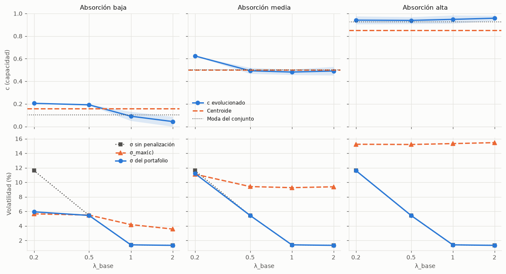

# 03 · Gen difuso `c`

## Qué se quiere mostrar

El cromosoma es `[w₁…w₅ | c]`. El gen `c` es la capacidad de absorber pérdidas que el AG "elige" dentro del conjunto difuso μ_CA del usuario (salida Mamdani sin desfuzzificar). El fitness lo usa dos veces:

- **Recompensa:** `+κ·μ_CA(c)`, que empuja `c` hacia donde μ_CA es máxima.
- **Restricción blanda:** `−φ·max(0, σ − σ_max(c))²` con `σ_max(c) = 0.03 + 0.13·c`, que permite más volatilidad cuanto mayor es `c`.

`c` solo "negocia" cuando el portafolio que el perfil desea tiene una volatilidad mayor que la que permite la zona de máxima pertenencia. Este experimento busca esos casos.

## Método

- Tres situaciones de absorción (monto S/ 10,000):

| Absorción | Ahorro total | Emergencia | r | Regla activa | Meseta de μ_CA máxima | Moda | Centroide |
|---|---|---|---|---|---|---|---|
| Baja | S/ 12,000 | 1 mes | 0.83 | RA5 → Baja (0.778) | [0, 0.206] | 0.103 | 0.157 |
| Media | S/ 20,000 | 4 meses | 0.50 | RA4 → Media (0.5) | [0.375, 0.625] | 0.500 | 0.500 |
| Alta | S/ 100,000 | 8 meses | 0.10 | RA2 → Alta (1.0) | [0.85, 1] | 0.925 | 0.853 |

- λ_base ∈ {0.2, 0.5, 1, 2} con H = 5 años (m_H = 1, así λ_ef = λ_base) y contexto neutral (0, 0). Modelo completo, 10 semillas: 120 corridas.
- Para cada caso se corre además el AG sin penalización ni recompensa (mismo λ_ef): "σ sin penalización" es la volatilidad que el perfil elegiría si la absorción no existiera.
- "Moda" es el centro de la meseta de máxima pertenencia. "Penalización activa" es el porcentaje de semillas con término de penalización distinto de 0; "Restricción activa", el porcentaje con σ ≥ σ_max(c) − 0.2 pp.
- Datos: `experiments/results/gene_runs.csv` y `gene_summary.csv`.

## Resultados

| Absorción | λ_base | c | μ_CA(c) | σ % | σ_max(c) % | σ sin penalización % | Penalización activa | Restricción activa |
|---|---|---|---|---|---|---|---|---|
| Baja | 0.2 | 0.205 ± 0.000 | 0.778 | 5.9 | 5.7 | 11.6 | 100 % | 100 % |
| Baja | 0.5 | 0.192 ± 0.004 | 0.778 | 5.4 | 5.5 | 5.4 | 0 % | 100 % |
| Baja | 1 | 0.091 ± 0.040 | 0.778 | 1.4 | 4.2 | 1.4 | 0 % | 0 % |
| Baja | 2 | 0.044 ± 0.044 | 0.778 | 1.3 | 3.6 | 1.3 | 0 % | 0 % |
| Media | 0.2 | 0.624 ± 0.001 | 0.500 | 11.2 | 11.1 | 11.6 | 100 % | 100 % |
| Media | 0.5 | 0.493 ± 0.027 | 0.500 | 5.4 | 9.4 | 5.4 | 0 % | 0 % |
| Media | 1 | 0.482 ± 0.024 | 0.500 | 1.4 | 9.3 | 1.4 | 0 % | 0 % |
| Media | 2 | 0.491 ± 0.038 | 0.500 | 1.3 | 9.4 | 1.3 | 0 % | 0 % |
| Alta | 0.2 | 0.941 ± 0.035 | 1.000 | 11.6 | 15.2 | 11.6 | 0 % | 0 % |
| Alta | 0.5 | 0.939 ± 0.031 | 1.000 | 5.4 | 15.2 | 5.4 | 0 % | 0 % |
| Alta | 1 | 0.948 ± 0.036 | 1.000 | 1.4 | 15.3 | 1.4 | 0 % | 0 % |
| Alta | 2 | 0.958 ± 0.024 | 1.000 | 1.3 | 15.5 | 1.3 | 0 % | 0 % |

## Interpretación (para el informe, sección 9.x)

**Cuándo `c` se separa de la moda y del centroide.** La agregación Mamdani recorta cada conjunto de salida a la fuerza de su regla, así que μ_CA tiene una meseta de pertenencia máxima. Dentro de ella la recompensa κ·μ_CA(c) es constante y `c` puede moverse sin costo. Por eso:

- Cuando la volatilidad deseada cabe con holgura (λ_base ≥ 1 en baja, λ_base ≥ 0.5 en media y cualquier λ con absorción alta), `c` queda en cualquier punto de la meseta: su media cae cerca de la moda (0.044–0.091 en baja, 0.48–0.49 en media, 0.94–0.96 en alta) con dispersión de 0.024 a 0.044 entre semillas, y no coincide con el centroide (que pondera también los bordes inclinados del conjunto).

**Cuándo el gen negocia (trade-off real).** Ocurre cuando la volatilidad que el perfil elegiría sin restricción supera σ_max en el borde derecho de la meseta. Con los datos actuales (W15), λ_base = 0.2 pide 11.6 % (el máximo del universo con tope 40 %: 40 % acciones, 40 % mixtos, 20 % bonos) y λ_base = 0.5 pide 5.4 %.

- **Absorción baja** (borde c = 0.206, σ_max = 5.7 %): con λ 0.2, `c` se queda en el borde (0.205) sin bajar μ_CA(c) de 0.778. Más allá, cada unidad de `c` cuesta κ·4 = 0.12 de recompensa (la pendiente del conjunto Baja es 4) y solo ahorra 2·φ·0.13·(σ − σ_max) ≈ 13·(σ − σ_max) de penalización; con un exceso de 0.2 pp el ahorro (≈ 0.03) es menor que el costo. Lo que cede es el portafolio: σ baja de 11.6 % a 5.9 %, con un pequeño exceso sobre σ_max (5.9 % frente a 5.7 %) que el retorno adicional compensa. Con λ 0.5 el portafolio deseado (σ 5.4 %) cabe dentro de la meseta, pero solo cerca de su borde: `c` se mueve a 0.192 ± 0.004 (σ_max 5.5 %) en las 10 semillas, sin penalización y sin recortar el portafolio. Es la negociación sin costo: `c` elige, dentro de la zona de máxima pertenencia, el punto que permite la volatilidad pedida.
- **Absorción media** (borde c = 0.625, σ_max = 11.1 %): con λ 0.2, `c` = 0.624 en las 10 semillas y σ baja de 11.6 % a 11.2 %.

En palabras simples: la capacidad de absorber pérdidas actúa como un límite flexible a la volatilidad. Si la persona puede asumir pérdidas, el límite no molesta. Si no puede, pero su perfil le pide arriesgar, el algoritmo busca el punto más alto de capacidad que sus datos todavía respaldan y recorta el riesgo hasta ese nivel, en lugar de suponer una capacidad que no tiene.

## Qué cambió con datos reales (W14)

- Antes negociaban baja con λ 0.2 y 0.5 (σ de 10.1 % a 6.0 % y de 8.5 % a 5.6 %); media con λ 0.2 rozaba el límite sin penalización. Ahora negocian baja y media con λ 0.2, y baja con λ 0.5 ya no (su σ sin penalización es 3.0 %).
- La causa es el nuevo universo: la σ máxima alcanzable con tope 40 % sube a ≈ 14.1 % (antes ≈ 10.7 %), porque los bonos tienen σ 6.5 %, los mixtos 12.3 % y la deuda casi no tiene riesgo. El paso entre perfiles es más abrupto: λ 0.2 toma casi todo el riesgo disponible y λ 0.5 casi nada.
- Las corridas que negocian convergen más lento: con absorción baja y λ 0.2, 9 de 10 semillas llegan al máximo de 200 generaciones (media con λ 0.2: 3 de 10; media y alta con λ 0.5: 1 de 10 cada una). El portafolio final casi no cambia entre semillas (desviación de pesos de hasta 0.4 pp en baja y 1.4 pp en media con λ 0.2), así que el límite de generaciones no altera la conclusión, pero se declara.

## Qué cambió con el Fondo 2 de las AFP (W15)

- Con el compuesto de W14 (σ 12.3 %) la σ máxima alcanzable era ≈ 14.1 %; con el Fondo 2 (σ 7.6 %) baja a 11.6 %, porque el portafolio más arriesgado lleva 40 % en mixtos. Por eso λ 0.2 recorta menos en absorción media (de 11.6 % a 11.2 %; antes de 14.1 % a 11.2 %) y en baja (de 11.6 % a 5.9 %; antes de 14.1 % a 6.0 %).
- Con λ 0.5 el perfil pide más volatilidad que antes (5.4 % frente a 3.0 %), porque los mixtos ofrecen renta variable con menos σ: en absorción baja `c` sube al borde de la meseta (0.192) para acomodarla, sin penalización.
- La convergencia es más rápida: solo 1 de las 120 corridas (absorción baja, λ 0.2, semilla 7) llega al máximo de 200 generaciones (antes 9 de 10 semillas en ese caso y 3 de 10 en media con λ 0.2). La desviación de los pesos entre semillas es a lo sumo 0.02 pp en baja y 0.25 pp en media con λ 0.2.

## Limitaciones observadas

- El efecto del gen depende de los parámetros de σ_max(c) (0.03 y 0.13): con ellos, la absorción alta no restringe portafolios del universo actual (σ máxima alcanzable ≈ 11.6 %, calculada sobre una rejilla de pesos con paso 5 %, por debajo de σ_max = 14.05 % en el borde izquierdo de la meseta alta). Baja y media sí restringen a los perfiles más arriesgados.
- La meseta hace que `c` no esté determinado de forma única cuando la restricción no actúa (dispersión 0.024–0.044). Para la explicación al usuario conviene seguir mostrando el centroide junto al `c` evolucionado.
