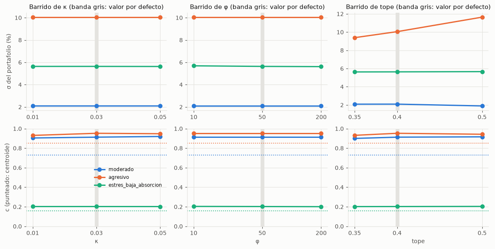

# 04 · Calibración de κ, φ, tope y piso

## Método

- Modelo completo con contexto neutral (0, 0). Se varía un parámetro a la vez y los demás quedan en su valor por defecto (κ = 0.03, φ = 50, tope = 0.40, piso = 0.05):

| Parámetro | Valores | Papel |
|---|---|---|
| κ | 0.01, 0.03, 0.05 | Peso de la recompensa κ·μ_CA(c) |
| φ | 10, 50, 200 | Dureza de la penalización por exceder σ_max(c) |
| Tope | 0.35, 0.40, 0.50 | Peso máximo por categoría (decisión D2) |
| Piso | 0, 0.05 | Peso mínimo por categoría (D2, W16); 0 es el modelo de tope solo |

- Arquetipos moderado y agresivo, como pide el plan. Se agregó un tercer caso, **estrés de baja absorción** (λ_base 0.5, H = 5 años, ahorro S/ 12,000, 1 mes de emergencia), porque en los dos arquetipos pedidos la penalización nunca se activa (ver [01 · Ablación](01-ablacion.md)) y κ y φ no podrían evaluarse. Con datos reales y el piso del 5 % tampoco se activa en este caso (ver abajo).
- 10 semillas por valor: 330 corridas. Datos: `experiments/results/calibration_runs.csv` y `calibration_summary.csv`.

## Resultados

Medias entre semillas; pesos, E y σ en %. "En el tope" y "En el piso" son el número medio de categorías con peso igual al tope y al piso (con piso 0, categorías en 0 %).

| Caso | Parámetro | Valor | Acciones | Mixtos | Deuda | Bonos | Plazo fijo | E | σ | HHI | En el tope | En el piso | c | \|c − centroide\| | μ_CA(c) | Penalización activa |
|---|---|---|---|---|---|---|---|---|---|---|---|---|---|---|---|---|
| Moderado | κ | 0.01 | 5.0 | 8.9 | 40.0 | 6.1 | 40.0 | 5.3 | 1.9 | 0.334 | 2.0 | 1.0 | 0.881 | 0.151 | 0.500 | 0 % |
| Moderado | κ | 0.03 | 5.0 | 8.9 | 40.0 | 6.1 | 40.0 | 5.3 | 1.9 | 0.334 | 2.0 | 1.0 | 0.908 | 0.177 | 0.500 | 0 % |
| Moderado | κ | 0.05 | 5.0 | 8.9 | 40.0 | 6.1 | 40.0 | 5.3 | 1.9 | 0.334 | 2.0 | 1.0 | 0.898 | 0.167 | 0.500 | 0 % |
| Moderado | φ | 10 | 5.0 | 8.9 | 40.0 | 6.1 | 40.0 | 5.3 | 1.9 | 0.334 | 2.0 | 1.0 | 0.908 | 0.177 | 0.500 | 0 % |
| Moderado | φ | 200 | 5.0 | 8.9 | 40.0 | 6.1 | 40.0 | 5.3 | 1.9 | 0.334 | 2.0 | 1.0 | 0.908 | 0.177 | 0.500 | 0 % |
| Moderado | Tope | 0.35 | 5.0 | 15.1 | 35.0 | 9.9 | 35.0 | 5.6 | 2.5 | 0.280 | 2.0 | 1.0 | 0.900 | 0.169 | 0.500 | 0 % |
| Moderado | Tope | 0.5 | 5.0 | 5.0 | 50.0 | 5.0 | 35.0 | 5.2 | 1.6 | 0.380 | 1.0 | 3.0 | 0.922 | 0.191 | 0.500 | 0 % |
| Moderado | Piso | 0 | 0.0 | 14.8 | 40.0 | 5.2 | 40.0 | 5.1 | 1.4 | 0.345 | 2.0 | 1.0 | 0.883 | 0.152 | 0.500 | 0 % |
| Agresivo | κ | 0.01 | 40.0 | 40.0 | 10.0 | 5.0 | 5.0 | 9.9 | 11.2 | 0.335 | 2.0 | 2.0 | 0.936 | 0.083 | 1.000 | 0 % |
| Agresivo | κ | 0.03 | 40.0 | 40.0 | 10.0 | 5.0 | 5.0 | 9.9 | 11.2 | 0.335 | 2.0 | 2.0 | 0.936 | 0.083 | 1.000 | 0 % |
| Agresivo | κ | 0.05 | 40.0 | 40.0 | 10.0 | 5.0 | 5.0 | 9.9 | 11.2 | 0.335 | 2.0 | 2.0 | 0.941 | 0.088 | 1.000 | 0 % |
| Agresivo | φ | 10 | 40.0 | 40.0 | 10.0 | 5.0 | 5.0 | 9.9 | 11.2 | 0.335 | 2.0 | 2.0 | 0.936 | 0.083 | 1.000 | 0 % |
| Agresivo | φ | 200 | 40.0 | 40.0 | 10.0 | 5.0 | 5.0 | 9.9 | 11.2 | 0.335 | 2.0 | 2.0 | 0.936 | 0.083 | 1.000 | 0 % |
| Agresivo | Tope | 0.35 | 35.0 | 35.0 | 20.0 | 5.0 | 5.0 | 9.3 | 9.8 | 0.290 | 2.0 | 2.0 | 0.944 | 0.091 | 1.000 | 0 % |
| Agresivo | Tope | 0.5 | 50.0 | 35.0 | 5.0 | 5.0 | 5.0 | 10.6 | 13.0 | 0.380 | 1.0 | 3.0 | 0.938 | 0.085 | 1.000 | 0 % |
| Agresivo | Piso | 0 | 40.0 | 40.0 | 20.0 | 0.0 | 0.0 | 9.9 | 11.1 | 0.360 | 2.0 | 2.0 | 0.956 | 0.103 | 1.000 | 0 % |
| Estrés | κ | 0.01 | 10.0 | 40.0 | 40.0 | 5.0 | 5.0 | 7.2 | 5.0 | 0.335 | 2.0 | 2.0 | 0.170 | 0.014 | 0.778 | 0 % |
| Estrés | κ | 0.03 | 10.0 | 40.0 | 40.0 | 5.0 | 5.0 | 7.2 | 5.0 | 0.335 | 2.0 | 2.0 | 0.169 | 0.013 | 0.778 | 0 % |
| Estrés | κ | 0.05 | 10.0 | 40.0 | 40.0 | 5.0 | 5.0 | 7.2 | 5.0 | 0.335 | 2.0 | 2.0 | 0.168 | 0.012 | 0.778 | 0 % |
| Estrés | φ | 10 | 10.0 | 40.0 | 40.0 | 5.0 | 5.0 | 7.2 | 5.0 | 0.335 | 2.0 | 2.0 | 0.169 | 0.013 | 0.778 | 0 % |
| Estrés | φ | 200 | 10.0 | 40.0 | 40.0 | 5.0 | 5.0 | 7.2 | 5.0 | 0.335 | 2.0 | 2.0 | 0.171 | 0.014 | 0.778 | 0 % |
| Estrés | Tope | 0.35 | 12.8 | 35.0 | 35.0 | 12.2 | 5.0 | 7.4 | 5.4 | 0.279 | 2.0 | 1.0 | 0.189 | 0.033 | 0.778 | 0 % |
| Estrés | Tope | 0.5 | 5.1 | 34.9 | 50.0 | 5.0 | 5.0 | 6.6 | 3.7 | 0.379 | 1.0 | 2.0 | 0.144 | 0.012 | 0.778 | 0 % |
| Estrés | Piso | 0 | 11.7 | 40.0 | 40.0 | 8.3 | 0.0 | 7.5 | 5.4 | 0.341 | 2.0 | 1.0 | 0.192 | 0.035 | 0.778 | 0 % |

Las filas φ = 50, tope = 0.40 y piso = 0.05 coinciden con κ = 0.03 (los cuatro son la configuración por defecto) y se omiten. La tabla completa está en `experiments/results/README.md`.

## Interpretación (para el informe, sección 9.x)

**κ (recompensa difusa).** En el rango 0.01–0.05 no cambia ningún peso en los tres casos; solo mueve `c` dentro de la meseta de μ_CA (por ejemplo, moderado 0.881 a 0.908). Todas las semillas quedan en la meseta también con κ = 0.01, gracias al muestreo de los `c` iniciales desde μ_CA y a su mutación más amplia (ver [01 · Ablación](01-ablacion.md#limitaciones-observadas)). κ = 0.03 da una recompensa (≤ 0.03) del mismo orden que las diferencias de fitness entre portafolios cercanos sin dominar el término de retorno y riesgo. **Se mantiene κ = 0.03.**

**φ (dureza de la penalización).** No actúa en ninguna fila del barrido: el caso de estrés (λ_base 0.5, absorción baja) elige σ = 5.0 %, por debajo de σ_max(c) = 5.2 % (con `c` ≈ 0.17, dentro de la meseta), y la penalización queda en 0 % de las semillas, también con tope 0.35 (σ 5.4 % frente a σ_max 5.5 %). El efecto de φ aparece sobre todo con λ_base = 0.2 (ver [03 · Gen difuso](03-gen-difuso.md): absorción baja, σ 5.9 % frente a σ_max 5.7 %, y media, 11.2 % frente a 11.1 %), donde la restricción ya se comporta casi como un límite duro con φ = 50. **Se mantiene φ = 50**, sin evidencia nueva a favor de cambiarlo.

**Tope por categoría.** Es el parámetro con mayor efecto:

- Con 0.50 el moderado concentra 85 % en dos categorías (deuda 50.0 %, plazo fijo 35.0 %, las otras tres en el piso; HHI 0.380, σ 1.6 %) y el agresivo 85 % en acciones y mixtos (50 % y 35 %; HHI 0.380, σ 13.0 %): reaparece el portafolio concentrado que motivó la decisión D2; el piso solo evita que sea de dos categorías.
- Con 0.35 el HHI baja (0.280 en moderado, 0.290 en agresivo). En el moderado el retorno esperado sube de 5.3 % a 5.6 % (con σ de 1.9 % a 2.5 %), porque el tope obliga a sacar peso de deuda y plazo fijo hacia mixtos y bonos; en el agresivo baja de 9.9 % a 9.3 %.
- 0.40 está en medio: el moderado tiene dos categorías en el tope y tres por debajo (mixtos 8.9 %, bonos 6.1 %, acciones en el piso) y el agresivo 40 / 40 / 10 / 5 / 5. **Se mantiene el tope de 0.40.** Si el equipo quisiera más diversificación, 0.35 es una alternativa defendible; no se cambia `data/parameters`.

**Piso por categoría (W16).** Es el costo de que ninguna categoría quede en 0 %. Se compara el piso 0 (modelo de tope solo) con el piso 0.05:

| Caso | Pesos con piso 0 (%) | Pesos con piso 0.05 (%) | E (%) | σ (%) | Fitness |
|---|---|---|---|---|---|
| Moderado | 0.0 / 14.8 / 40.0 / 5.2 / 40.0 | 5.0 / 8.9 / 40.0 / 6.1 / 40.0 | 5.06 → 5.30 | 1.40 → 1.90 | 0.0516 → 0.0490 |
| Agresivo | 40.0 / 40.0 / 20.0 / 0.0 / 0.0 | 40.0 / 40.0 / 10.0 / 5.0 / 5.0 | 9.93 → 9.91 | 11.08 → 11.20 | 0.0905 → 0.0899 |
| Estrés | 11.7 / 40.0 / 40.0 / 8.3 / 0.0 | 10.0 / 40.0 / 40.0 / 5.0 / 5.0 | 7.47 → 7.24 | 5.44 → 5.01 | 0.0709 → 0.0707 |

- El costo en el objetivo es pequeño: el fitness baja 0.0026 en el moderado, 0.0006 en el agresivo y 0.0002 en el estrés.
- El efecto sobre E no tiene un signo fijo, porque depende de qué categoría estaba en 0 %. En el agresivo, pasar 10 pp de deuda a bonos y plazo fijo casi no cambia E (−0.02 pp). En el estrés, el piso de plazo fijo saca peso de acciones y bonos: E −0.23 pp y σ −0.43 pp. En el moderado, el 5 % obligatorio en acciones sube E (+0.24 pp) pero también σ (+0.50 pp), y con λ_ef = 1 el riesgo adicional pesa más que el retorno.
- **Se adopta el piso 0.05** por explicabilidad (ver [D2](../analisis/10-decisiones-d1-d2-d5.md#ampliación-w16-tope-40--y-piso-5-)): el costo medido es menor que 0.003 de fitness y a lo sumo ±0.25 pp de E.

## Qué cambió con datos reales (W14)

- Antes el caso de estrés activaba la penalización en 70 % a 100 % de las semillas (σ 5.6–5.7 %, con 21 % en acciones); ahora elige 11.6 % en acciones y σ 3.0 %, sin penalización. φ ya no se puede evaluar en este caso; el experimento del gen difuso lo cubre con λ_base = 0.2.
- En el agresivo la deuda reemplaza a los mixtos y a parte de los bonos (antes 40/20/0/40/0; ahora 40/0/40/20/0) y en el moderado deuda y plazo fijo quedan en el tope en lugar de bonos y plazo fijo. Los mixtos (compuesto 0.5 × acciones + 0.5 × bonos) quedan en 0 % en todas las filas.
- Las decisiones sobre κ, φ y tope no cambian.

## Qué cambió con el Fondo 2 de las AFP (W15)

- Los mixtos pasan de 0 % en todas las filas a 5.0 %–50.0 %: en el moderado reemplazan a las acciones (3.0 % → 0 %) y a parte de los bonos (17.0 % → 5.2 %); en el agresivo reemplazan a la deuda y a los bonos (40/0/40/20/0 → 40/40/20/0/0, E de 8.7 % a 9.9 %, σ de 9.2 % a 11.1 %).
- El caso de estrés pide más riesgo (σ 5.4 %, antes 3.0 %; 40 % en mixtos) y queda al borde de σ_max(c): la penalización se activa con tope 0.35, de modo que φ vuelve a ser observable en este caso, aunque solo en esa fila.
- Convergencia: 3 de las 270 corridas (estrés con tope 0.35, semillas 1, 3 y 6) llegan al máximo de 200 generaciones; el resto converge.
- Las decisiones sobre κ, φ y tope no cambian.

## Qué cambió con el piso del 5 % (W16)

- Se agregó el barrido del piso (0 y 0.05) y la columna "En el piso"; las demás filas se calcularon con el piso 0.05 (330 corridas, todas convergen).
- Con el piso, la penalización deja de activarse con tope 0.35 en el caso de estrés (antes 100 % de las semillas): el piso de plazo fijo baja σ de 5.7 % a 5.4 %, justo bajo σ_max(c) = 5.5 %. φ queda sin efecto observable en este experimento; el experimento del gen difuso lo cubre con λ_base = 0.2.
- Con tope 0.50 el piso evita los portafolios de dos categorías (antes acciones 50 % y mixtos 50 % en el agresivo), pero no la concentración (85 % en dos categorías).
- Las decisiones sobre κ, φ y tope no cambian.

## Limitaciones observadas

- κ y φ son poco sensibles en el rango probado. Esto es una buena noticia para la robustez, pero también significa que el experimento no los "calibra" en sentido estricto: confirma que los valores por defecto están en una zona estable.
- La penalización solo es relevante con absorción baja o media y perfiles muy arriesgados (λ_base = 0.2); para la mayoría de usuarios el resultado depende de λ_ef, del contexto y del tope.
