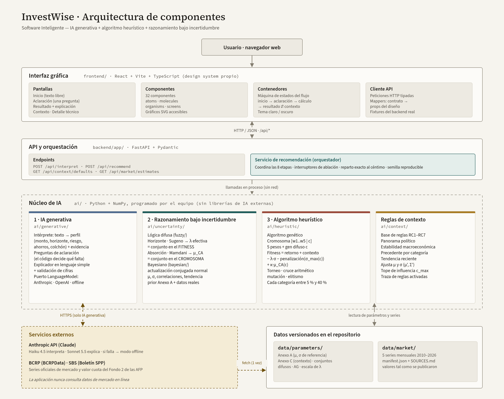
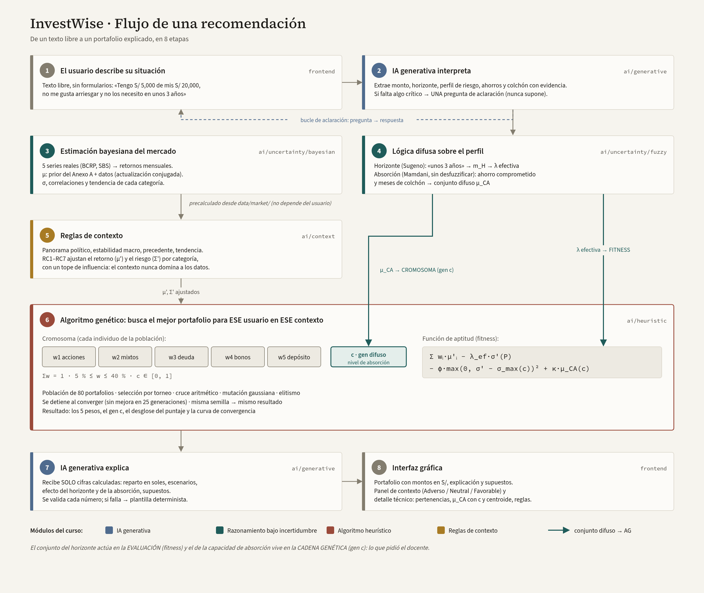
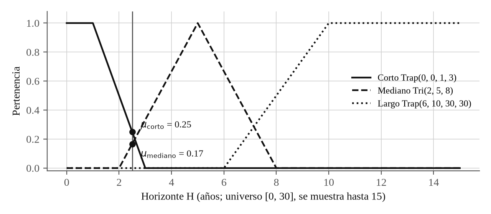
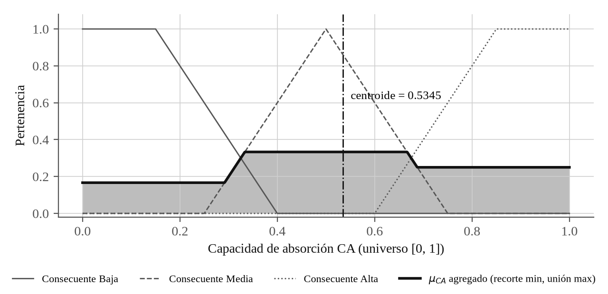
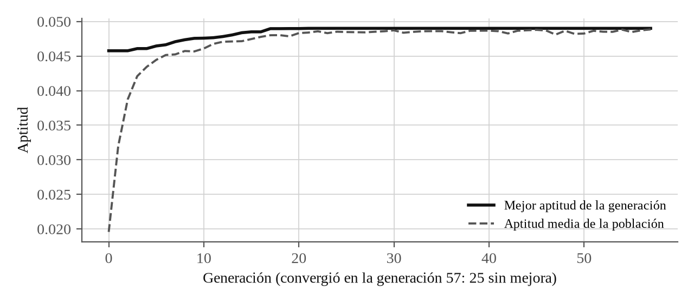

# 2. Arquitectura de software inteligente

Este capítulo presenta la arquitectura de InvestWise y describe cada componente: su responsabilidad, sus entradas y salidas (contratos), su diseño interno, las fórmulas y parámetros que emplea y, cuando ayuda a comprenderlo, un ejemplo numérico calculado con el código del proyecto.

## 2.1. Visión general

La aplicación se organiza en tres capas desplegables y una capa de datos (@fig:componentes):

- la **interfaz gráfica** (`frontend/`), una aplicación web en React que se ejecuta en el navegador del usuario;
- la **API y orquestación** (`backend/app/`), un servicio FastAPI que expone el flujo mediante HTTP y JSON y coordina las etapas del cálculo;
- el **núcleo de IA** (`ai/`), una biblioteca de Python y NumPy programada por el equipo que contiene los módulos de IA generativa, razonamiento bajo incertidumbre, reglas de contexto y algoritmo heurístico;
- los **datos versionados** (`data/`), con las series de mercado y los parámetros del sistema en archivos CSV y JSON.

La arquitectura sigue el estilo hexagonal (puertos y adaptadores). El núcleo de IA no conoce la web ni a los proveedores de modelos de lenguaje: recibe datos y devuelve resultados. Las dependencias apuntan siempre hacia el núcleo, como resume la @tab:capas.

Tabla: {#tab:capas} Capas de la arquitectura y reglas de dependencia

| Capa | Ubicación | Responsabilidad | Puede depender de |
|---|---|---|---|
| Núcleo de IA | `ai/` | Lógica difusa, inferencia bayesiana, reglas de contexto, algoritmo genético, interpretación y explicación | NumPy y los tipos de `ai/shared` |
| Aplicación | `backend/app/services/` | Orquesta el flujo de ocho etapas | `ai/` |
| Adaptadores de entrada | `backend/app/api/` | Rutas HTTP (FastAPI) y validación de esquemas (Pydantic) | Aplicación |
| Adaptadores de salida | `ai/generative/adapters/` | Proveedores de modelos de lenguaje (Anthropic, compatible con OpenAI) y modo sin conexión | Puerto `LanguageModel` |
| Presentación | `frontend/` | Interfaz gráfica en React | API HTTP |

Tres reglas de dependencia se verifican en el código: `ai/` nunca importa FastAPI ni `backend/`; el módulo heurístico no conoce la implementación difusa ni la de contexto, sino que recibe ya calculados λ_ef, el conjunto μ_CA, μ′ y Σ′, lo que permite probar cada módulo de forma aislada; y el único acceso a la red dentro de `ai/` está en los adaptadores de IA generativa, detrás de un puerto. La aplicación nunca consulta datos de mercado en línea: las series se descargan una sola vez con un script y se versionan en el repositorio.




## 2.2. Flujo de una recomendación

Una recomendación recorre ocho etapas (@fig:flujo y @tab:etapas). Las etapas 1 y 2 se repiten mientras falten datos: el sistema formula una pregunta, el usuario responde y la conversación completa se vuelve a interpretar. La etapa 3 no depende del usuario y se calcula una sola vez por proceso.

Tabla: {#tab:etapas} {split} Etapas del flujo, módulo responsable y transformación que realiza

| Etapa | Módulo | Entrada → salida |
|---|---|---|
| 1 | Interfaz gráfica | Texto libre del usuario |
| 2 | IA generativa (interpretación) | Texto e historial → perfil estructurado o pregunta de aclaración |
| 3 | Estimación bayesiana | Series mensuales → μ, σ, correlaciones ρ y tendencia s_tend (precalculado) |
| 4 | Lógica difusa | Horizonte → λ_ef; ahorro comprometido y fondo de emergencia → conjunto μ_CA y centroide |
| 5 | Reglas de contexto | μ, σ, ρ, s_tend y factores → μ′, σ′, Σ′ y reglas activadas |
| 6 | Algoritmo genético | λ_ef, μ_CA, μ′, Σ′ → mejor cromosoma `[w │ c]`, desglose de la aptitud e historial |
| 7 | IA generativa (explicación) | Cifras calculadas → explicación en lenguaje simple validada |
| 8 | Interfaz gráfica | Portafolio, explicación, panel de contexto y detalle técnico |



La @fig:componentes y la @fig:flujo muestran la restricción de tope de 40 % por categoría; desde la ampliación de la decisión D2 se aplica además un piso de 5 % por categoría (sección 2.9 y Anexo C).

## 2.3. Interfaz gráfica

**Responsabilidad.** Conducir la conversación con el usuario, presentar el resultado de forma comprensible para una persona sin conocimientos financieros y exponer, para usuarios avanzados y para la evaluación, todo lo que el sistema calculó.

**Tecnología.** React 18, Vite 5 y TypeScript 5. Los gráficos se dibujan en SVG escrito por el equipo, sin bibliotecas de gráficos; las series se distinguen por color y también por tipo de trazo (continuo, discontinuo, punteado), y cada gráfico ofrece una tabla equivalente.

**Pantallas.** La aplicación tiene cuatro pantallas: inicio (texto libre con un ejemplo), aclaración (una pregunta a la vez con el panel «lo que entendimos» y la frase de evidencia de cada dato), resultado (distribución en soles y porcentaje, explicación, escenarios y supuestos) y contexto (selectores de panorama político y estabilidad macroeconómica con la comparación antes y después). El detalle técnico es una sección desplegable de la pantalla de resultado (@fig:detalle).


**Sistema de diseño.** Los componentes siguen el diseño atómico: 7 átomos (por ejemplo `Button`, `Money`, `CategoryDot`), 9 moléculas (`AllocationRow`, `FactorSelector`, `QuestionField`, `Switches`, entre otras), 14 organismos (`AllocationBreakdown`, `ClarificationForm`, `ExplanationText`, `MembershipChart`, `AbsorptionChart`, `ConvergenceChart`, `RulesTable`, `ScoreBreakdown`, `TechnicalDetail`, entre otros) y 4 pantallas. Los colores, la tipografía (Source Serif 4 para títulos y Source Sans 3 para la interfaz) y los espaciados se definen como *tokens* en `frontend/src/styles/tokens.json`, de los que se generan las variables CSS de los temas claro y oscuro. Cada categoría de inversión tiene un color propio y estable. El diseño se adapta a anchos desde 360 píxeles.

**Patrón contenedor-presentacional.** Los componentes presentacionales solo reciben propiedades y dibujan; la lógica y las llamadas a la API viven en los contenedores (`AppContainer`, `HomeContainer`, `ClarificationContainer`, `ResultContainer`, `ContextContainer`). Así cada pantalla se prueba con datos fijos y la lógica se prueba sin interfaz.

**Máquina de estados del flujo.** El estado de la aplicación lo gobierna una función reductora pura (`frontend/src/state/flow.ts`) con seis fases: `input` → `interpreting` → `clarifying` → `calculating` → `result` ⇄ `context`. Los eventos (`submitted`, `interpreted`, `answered`, `assumptionConfirmed`, `recommended`, `failed`, `retried`, `factorChanged`, `switchesChanged`, `contextOpened`, `restarted`, entre otros) solo producen transiciones válidas desde la fase actual. Tres decisiones de diseño resultan relevantes:

- cada petición lleva un identificador y una respuesta que no corresponde a la última petición se descarta, de modo que una respuesta tardía no sobrescribe un estado más reciente;
- la semilla del primer resultado se reutiliza en todos los recálculos (cambio de contexto o de interruptores), de modo que la diferencia observada se debe solo a la entrada modificada;
- el último resultado con contexto neutral se conserva como referencia del «antes» en la pantalla de contexto, y ante un error la aplicación vuelve a la fase de origen sin perder el texto del usuario.

**Cliente de la API y *mappers*.** `frontend/src/api/client.ts` es un cliente `fetch` delgado y tipado para las rutas `/api/*`, que distingue cuatro clases de error (`network`, `http`, `validation` con el mensaje del servidor y `aborted`) y admite cancelación. `frontend/src/api/mappers.ts` traduce los contratos del backend a las propiedades de los componentes (`toUnderstood`, `toQuestion`, `toAllocation`, `toTechnical`, `toResult`, `toFactors`), de modo que un cambio en el contrato se corrige en un solo lugar. Las pruebas usan respuestas capturadas del backend real (`frontend/src/api/__fixtures__/`).

## 2.4. API y orquestación

**Responsabilidad.** Exponer el flujo mediante HTTP, validar las entradas y coordinar las etapas 3 a 7 en un caso de uso único.

Tabla: Rutas de la API

| Método | Ruta | Uso |
|---|---|---|
| `GET` | `/health` | Estado del servicio |
| `POST` | `/api/interpret` | Etapa 2: recibe la conversación y devuelve el perfil, la evidencia, los datos faltantes y, si corresponde, una pregunta |
| `POST` | `/api/recommend` | Etapas 3 a 7: recibe el perfil completo, los factores de contexto, los interruptores y una semilla opcional |
| `GET` | `/api/context/defaults` | Factores de contexto, niveles (Adverso −1, Neutral 0, Favorable +1) y parámetros por defecto |
| `GET` | `/api/market/estimates` | μ, σ, correlaciones, tendencia y procedencia de cada categoría |

**Contratos.** Los esquemas de entrada y salida se definen con Pydantic (`backend/app/api/schemas.py`). Un perfil inválido (por ejemplo, un monto no positivo) se rechaza con el código HTTP 422 y un mensaje explícito. La semilla, cuando se envía, debe estar entre 0 y 2³² − 1. Cada respuesta indica el modo de IA generativa en uso (`offline` o `llm`) y el proveedor.

**Interpretación sin estado.** `/api/interpret` recibe siempre la conversación completa; las preguntas del sistema llevan el campo que preguntaron. El servidor no guarda sesiones, lo que simplifica el despliegue y hace reproducible cada interpretación.

**Orquestación.** El servicio `recommend` (`backend/app/services/recommendation.py`) ejecuta, en orden: lectura de las estimaciones de mercado (calculadas una vez por proceso y guardadas en caché), evaluación difusa del horizonte (λ_ef), evaluación difusa de la absorción (μ_CA), ajuste de contexto (μ′, Σ′), algoritmo genético, reparto en soles, construcción de la entrada de la explicación y explicación. La respuesta reúne el reparto, el retorno esperado E, la volatilidad σ, el gen c, los escenarios, la explicación, los supuestos y un bloque técnico con todos los valores intermedios (parámetros por categoría, λ_base, m_H, λ_ef, curvas de pertenencia, conjunto μ_CA con c y centroide, reglas activadas con su grado de activación, desglose de la aptitud y curva de convergencia).

**Interruptores de ablación.** Con `fuzzy = false` se usa m_H = 1 (λ_ef = λ_base) y se eliminan la penalización por volatilidad y la recompensa del gen c; con `context = false` se usa cᵢ = 0 y σ′ = σ. Los supuestos declarados al usuario se generan según los interruptores activos: contexto no informado (se asume neutral), absorción no informada (se asume capacidad media) o categoría sin datos (se usan valores de referencia).

**Semilla.** Si la petición no trae semilla, el servicio genera una aleatoria y la devuelve; la interfaz la reutiliza en los recálculos. Con la misma semilla y la misma entrada el resultado es idéntico.

**Reparto exacto al céntimo.** Los pesos del algoritmo genético se convierten en montos con el método del mayor residuo: se multiplica cada peso por el total en céntimos, se toma la parte entera y los céntimos faltantes se asignan a las categorías con mayor parte decimal. La suma de los montos coincide siempre con el monto invertido. En el ejemplo de la sección 2.9.9 (S/ 10,000.00), los pesos de fondos mixtos y bonos equivalen a 89 243,48 y 60 756,52 céntimos: la parte entera suma 999 999 céntimos y el céntimo faltante se asigna a bonos, el de mayor residuo, que queda en S/ 607.57.

## 2.5. IA generativa

**Responsabilidad.** Convertir el lenguaje del usuario en datos estructurados (interpretación) y convertir los resultados numéricos en un texto comprensible (explicación). El principio de diseño es que **el modelo de lenguaje interpreta y redacta, y el código decide y calcula**: el modelo no decide si el perfil está completo, no asigna la aversión al riesgo, no calcula el portafolio ni los escenarios y no puede introducir cifras propias.

### 2.5.1. Puerto y adaptadores

El núcleo depende únicamente del puerto `LanguageModel` (`ai/generative/port.py`), que expone una operación: `complete_json(system, messages, schema, temperature, max_tokens)`, que devuelve un objeto JSON conforme al esquema o lanza `LanguageModelError`. Cada adaptador implementa el puerto con el mecanismo nativo de su proveedor (@tab:adaptadores). El proveedor se elige con la variable `LLM_PROVIDER`; si falta la clave de la API o el SDK, la aplicación arranca en modo sin conexión en lugar de fallar.

Tabla: {#tab:adaptadores} Adaptadores del puerto LanguageModel

| Adaptador | Mecanismo de salida estructurada | Modelos y parámetros |
|---|---|---|
| Anthropic (por defecto) | Una herramienta `responder_json` cuyo `input_schema` es el esquema; la respuesta es la entrada de esa herramienta | Claude Haiku 4.5 interpreta y redacta preguntas (uso forzado de la herramienta, temperatura enviada); Claude Sonnet 5.5 explica (selección automática de herramienta con instrucción explícita, esfuerzo bajo y al menos 4096 tokens, porque no admite uso forzado ni temperatura). Tiempo máximo 30 s y un reintento del SDK |
| Compatible con OpenAI | `response_format` de tipo `json_schema` (no estricto); si el proveedor lo rechaza, un reintento con `json_object` y el esquema en el prompt | Modelo configurable (`gpt-4o-mini` por defecto); admite proveedores compatibles mediante `OPENAI_BASE_URL` |
| Sin conexión (*offline*) | Extractor determinista en español (expresiones regulares y palabras clave) y plantilla de explicación | Sin red ni costo; mismo contrato de salida. Es el modo de las pruebas automáticas y el respaldo ante cualquier fallo |

Un mismo objeto Anthropic atiende dos modelos: el adaptador elige Sonnet 5.5 cuando la petición lleva el esquema de explicación y Haiku 4.5 en los demás casos, sin cambiar el puerto.

### 2.5.2. Prompts versionados y esquemas JSON

Los prompts son archivos de texto versionados en `ai/generative/prompts/` (`interpret.v1.md`, `interpret.v2.md`, `clarify.v1.md`, `explain.v1.md`); la versión usada se registra en cada respuesta. La versión vigente de interpretación es la 2. La versión 1 indicaba que una expresión vaga no es una cifra; en las pruebas se observó que el modelo convertía expresiones como «en unos años» o «más adelante» en la etiqueta «largo», lo que vuelve al sistema más arriesgado sin que el usuario lo haya dicho. La versión 2 enumera las expresiones que sí nombran un plazo («corto plazo», «para mi jubilación») y las que son vagas («unos años», «más adelante», «algún día»), indica que ante la duda se devuelva `null` para que el sistema pregunte, y agrega dos ejemplos.

Tabla: Esquema de salida de la interpretación

| Campo | Tipo | Regla |
|---|---|---|
| `monto_invertir`, `ahorro_total` | número (soles) o `null` | «5 mil» = 5000; en otra moneda, `null` y una contradicción |
| `horizonte_anios` | número o `null` | Solo si hay una cifra («unos 3 años» = 3; «18 meses» = 1,5) |
| `horizonte_etiqueta` | `corto`, `mediano`, `largo` o `null` | Solo si el plazo se nombra de forma inequívoca |
| `perfil_riesgo` | una de cinco etiquetas o `null` | `null` ante señales opuestas |
| `cobertura_emergencia_meses` | número o `null` | Meses de gastos cubiertos |
| `evidencia` | objeto campo → frase | Frase textual del usuario para cada campo no nulo |
| `rechazos` | lista de campos | Datos que el usuario no quiso dar |
| `contradicciones` | lista de textos | Por ejemplo, «máxima ganancia» y «no puedo perder nada» |

El código valida cada respuesta contra el esquema. Un campo con valor pero sin evidencia se descarta (nunca se supone), los montos deben ser positivos y un horizonte o una cobertura de 0 se aceptan como respuestas válidas. Si la respuesta es inválida se reintenta una vez; si vuelve a fallar, se usa el extractor sin conexión. La interpretación usa temperatura 0 y hasta 500 tokens.

### 2.5.3. Política de aclaración decidida por el código

Con el perfil extraído, el código (no el modelo) decide qué preguntar:

1. Los campos críticos se piden en orden de prioridad: monto, horizonte y perfil de riesgo. Un perfil de riesgo con contradicciones se trata como faltante.
2. Los campos de absorción (ahorro total y meses de fondo de emergencia) se preguntan una sola vez cada uno. Si el usuario se niega («Prefiero no responder») o no responde, se asume una capacidad media de absorción y se declara como supuesto.
3. Se formula una sola pregunta a la vez. El modelo solo redacta su texto (prompt `clarify.v1`, temperatura 0,3, hasta 150 tokens, a lo sumo 300 caracteres); si falla, se usa una plantilla fija para ese campo, con opciones o con un campo numérico.

El perfil queda completo cuando no hay pregunta pendiente. La λ_base se obtiene de la etiqueta de riesgo con la tabla de `data/parameters/risk_profiles.json` (Anexo A), lo que hace la clasificación reproducible y auditable.

### 2.5.4. Explicación con validación de cifras

El código arma la entrada de la explicación: monto total, reparto con el nombre y una descripción sencilla de cada categoría, escenarios, perfil, el efecto del horizonte y de la absorción expresados como frases (por ejemplo, «el sistema fue más cauteloso porque el plazo es corto» cuando m_H > 1,05), los supuestos y la lista de **cifras permitidas**: el monto, el monto y el porcentaje de cada categoría, los montos de los escenarios, el horizonte y los números que aparecen en los supuestos.

Los escenarios de ganancia o pérdida a un año los calcula el código:

```
año malo   = monto · (E − 1.65·σ)
año normal = monto · E
año bueno  = monto · (E + 1.65·σ)
```

donde E y σ son el retorno esperado y la volatilidad del portafolio. El factor 1,65 corresponde aproximadamente al cuantil unilateral del 5 % de una distribución normal; se usa como simplificación didáctica, no como pronóstico.

El prompt `explain.v1` impone reglas: usar solo las cifras permitidas, acompañar cada porcentaje de su monto en soles con el formato S/ 1,250.00, traducir de inmediato cada término técnico, explicar el riesgo con los escenarios, describir el efecto del horizonte y de la absorción sin nombrar la técnica, declarar los supuestos como ajustables y no presentar el resultado como asesoría personal. La respuesta (resumen, de 3 a 6 párrafos, escenarios y supuestos) pasa por un validador que comprueba:

- el esquema JSON;
- que cada número del texto coincida con una cifra permitida, con una tolerancia de redondeo de max(0,01; media unidad del último decimal escrito);
- el formato de moneda y que toda oración con un porcentaje incluya un monto en soles;
- que los montos de los escenarios no se alteren y que se declaren todos los supuestos.

Si la validación falla, se reenvía la respuesta al modelo con la lista de errores y se pide una corrección (un reintento). Si vuelve a fallar, se usa una plantilla determinista construida solo con cifras permitidas, que pasa por el mismo validador. La explicación usa temperatura 0,3 y hasta 1200 tokens.

## 2.6. Razonamiento bajo incertidumbre: lógica difusa

**Responsabilidad.** Tratar la imprecisión del lenguaje del usuario. La teoría del curso distingue la incertidumbre probabilística, que se mide por frecuencias, de la imprecisión o vaguedad, propia del lenguaje. La primera se trata con inferencia bayesiana (sección 2.7); la segunda, con lógica difusa. El módulo implementa un motor de Sugeno de orden cero y un motor de Mamdani propios (`ai/uncertainty/fuzzy/`), con funciones de pertenencia triangulares `Tri(a, b, c)` y trapezoidales `Trap(a, b, c, d)` y operadores de Zadeh (Y = mínimo, O = máximo). Siguiendo la observación del docente, uno de los conjuntos difusos actúa en la función de aptitud y el otro en el cromosoma.

### 2.6.1. Horizonte temporal: el conjunto difuso de la función de aptitud

El horizonte es cuánto tiempo puede pasar el usuario sin necesitar el dinero. El criterio práctico de las finanzas personales es que un horizonte corto exige más cautela, porque no hay tiempo para recuperarse de una caída, y uno largo tolera más variabilidad. Con un umbral rígido («menos de 3 años es corto»), dos personas con 2,9 y 3,1 años recibirían recomendaciones muy distintas; con conjuntos difusos el cambio es gradual.

- **Entrada:** horizonte H en años (universo [0, 30]) o una etiqueta cualitativa, y la λ_base del perfil.
- **Salida:** pertenencias, multiplicador m_H y aversión efectiva λ_ef.

Tabla: Conjuntos difusos y reglas del horizonte (Sugeno de orden cero)

| Conjunto | Función de pertenencia | Regla | Consecuente m_H |
|---|---|---|---|
| Corto | `Trap(0, 0, 1, 3)` | RH1: si H es corto | 1,5 (más cautela) |
| Mediano | `Tri(2, 5, 8)` | RH2: si H es mediano | 1,0 (sin modulación) |
| Largo | `Trap(6, 10, 30, 30)` | RH3: si H es largo | 0,7 (menos cautela) |

La salida es el promedio de los consecuentes ponderado por las pertenencias:

```
m_H  = Σₖ μₖ(H)·zₖ / Σₖ μₖ(H)
λ_ef = λ_base · m_H
```

Si el usuario solo da una etiqueta («a largo plazo»), esa etiqueta recibe pertenencia 1 y las demás 0. Con la escala de λ_base (0,2 a 3,0), λ_ef queda entre 0,14 y 4,5.

**Ejemplo (H = 2,5 años, perfil conservador, λ_base = 2).** Las pertenencias son μ_corto = (3 − 2,5) / 2 = 0,25, μ_mediano = (2,5 − 2) / 3 = 0,167 y μ_largo = 0 (@fig:horizonte). Entonces m_H = (0,25·1,5 + 0,167·1,0) / (0,25 + 0,167) = 1,30 y λ_ef = 2 × 1,30 = 2,6: el sistema se vuelve más cauteloso de lo declarado porque el dinero se necesitará relativamente pronto.



λ_ef entra en la función de aptitud multiplicando el riesgo del portafolio (sección 2.9.4): el horizonte cambia **cómo se califica** a cada individuo, no lo que el individuo es. Por eso es el conjunto difuso de la función de aptitud.

### 2.6.2. Capacidad de absorción: el conjunto difuso del cromosoma

La capacidad de absorber pérdidas depende de qué parte de los ahorros se compromete y de cuántos meses de gastos están cubiertos por un fondo de emergencia. Se modela con un sistema de Mamdani con dos entradas y seis reglas.

- **Entradas:** proporción comprometida r = monto ÷ ahorro total (universo [0, 1]) y meses de fondo de emergencia E (universo [0, 12]).
- **Salida:** conjunto difuso agregado μ_CA sobre la capacidad de absorción CA ∈ [0, 1], grados de activación de cada regla y centroide.

Tabla: Conjuntos difusos de entrada y salida del sistema de absorción

| Variable | Conjunto | Función de pertenencia |
|---|---|---|
| Proporción r | Bajo | `Trap(0, 0, 0.2, 0.4)` |
| | Medio | `Tri(0.2, 0.5, 0.8)` |
| | Alto | `Trap(0.6, 0.9, 1, 1)` |
| Fondo de emergencia E (meses) | Insuficiente | `Trap(0, 0, 1, 4)` |
| | Adecuada | `Trap(2, 6, 12, 12)` |
| Capacidad CA (salida) | Baja | `Trap(0, 0, 0.15, 0.4)` |
| | Media | `Tri(0.25, 0.5, 0.75)` |
| | Alta | `Trap(0.6, 0.85, 1, 1)` |

Tabla: Reglas del sistema de absorción

| Regla | Proporción r | Fondo de emergencia E | Capacidad CA |
|---|---|---|---|
| RA1 | Bajo | Insuficiente | Media |
| RA2 | Bajo | Adecuada | Alta |
| RA3 | Medio | Insuficiente | Baja |
| RA4 | Medio | Adecuada | Media |
| RA5 | Alto | Insuficiente | Baja |
| RA6 | Alto | Adecuada | Media |

El motor aplica los pasos del sistema de inferencia vistos en clase: (1) fuzzificación de r y E; (2) grado de activación de cada regla con el operador Y (mínimo); (3) implicación por mínimo, que recorta el conjunto consecuente a la altura de su activación; y (4) agregación por máximo de los conjuntos recortados, discretizada en 1001 puntos del universo:

```
αₖ      = min( μ_A(r), μ_B(E) )                       activación de la regla k
μ_CA(x) = maxₖ min( αₖ, μ_Cₖ(x) ),   x ∈ [0, 1]       conjunto agregado
```

**El paso 5 (desfuzzificación) no se aplica dentro del algoritmo genético.** El conjunto agregado μ_CA se conserva completo y el algoritmo genético elige un punto c de su universo (el gen difuso del cromosoma), evaluado con μ_CA(c) en la función de aptitud. El centroide `x* = ∫x·μ_CA(x)dx / ∫μ_CA(x)dx` se calcula solo como referencia para la explicación y para compararlo con el c evolucionado. Si el usuario no informa su ahorro o su fondo de emergencia, μ_CA es el conjunto Media y se declara el supuesto.

**Ejemplo (S/ 5,000 de S/ 20,000 de ahorro y 3 meses de fondo de emergencia).** r = 0,25 y E = 3. Pertenencias: r es Bajo con 0,75, Medio con 0,167 y Alto con 0; E es Insuficiente con 0,333 y Adecuada con 0,25. Activaciones: RA1 = min(0,75; 0,333) = 0,333 (Media); RA2 = min(0,75; 0,25) = 0,25 (Alta); RA3 = min(0,167; 0,333) = 0,167 (Baja); RA4 = min(0,167; 0,25) = 0,167 (Media); RA5 = RA6 = 0. El conjunto agregado combina Baja recortada a 0,167, Media recortada a 0,333 y Alta recortada a 0,25 (@fig:absorcion). Su centroide es 0,5345.



### 2.6.3. Validación del motor de Mamdani

El motor se validó con el ejercicio de la propina resuelto en clase (servicio = 3, comida = 8). La diapositiva informa P\* = 15,9 %. Al reproducir el cálculo por integrales se verificó que la función agregada de la diapositiva usa `(15 − P)/5` en todo el tramo 10 < P < 13,33 sin recortarla en la activación α₁ = 2/3 de la regla R1; entre P = 10 y P = 11,67 esa expresión supera 2/3. Con el recorte, el área es 245/18 y el centroide exacto es (17650/81) / (245/18) = 16,009 %, que es el valor que obtiene el motor. La prueba automática `test_tip_centroid_matches_exact_integral` comprueba el valor exacto y su cercanía al de la diapositiva. Del mismo modo, una prueba del horizonte verifica el ejemplo H = 2,5 → m_H = 1,30.

## 2.7. Razonamiento bajo incertidumbre: estimación bayesiana

**Responsabilidad.** Estimar el retorno esperado μ, la volatilidad σ, las correlaciones ρ y la tendencia reciente s_tend de cada categoría a partir de datos reales, combinando las observaciones con valores de referencia.

- **Entrada:** el manifiesto `data/market/manifest.json`, las cinco series CSV y los parámetros `categories.json` (valores de referencia del Anexo A del informe de avance) y `bayes.json`.
- **Salida:** `MarketEstimates` (μ, σ, matriz de correlaciones, s_tend) y la procedencia de cada categoría (fuente, código de serie, meses usados, media y σ de los datos, media y desviación posteriores).

### 2.7.1. Fuentes de datos

Tabla: Series de mercado usadas por categoría

| Categoría | Fuente y serie | Tipo | Periodo |
|---|---|---|---|
| Fondos de acciones | BCRP `PN01142MM`, Índice General de la Bolsa de Valores de Lima | Índice | 2010-01 a 2026-08 |
| Fondos mixtos | SBS, boletín B-220932, valor cuota del Fondo de Pensiones Tipo 2 (promedio de Integra, Prima y Profuturo) | Índice encadenado | 2010-01 a 2026-08 |
| Fondos de deuda | BCRP `PN06503OM`, tasa del saldo de Certificados de Depósito del BCRP | Rendimiento | 2010-01 a 2026-08 |
| Bonos soberanos (BTP) | BCRP `PD31895MM`, rendimiento del bono del gobierno peruano a 10 años en soles | Rendimiento | 2010-01 a 2026-09 |
| Depósito a plazo fijo | BCRP `PN07814NM`, tasa pasiva promedio en moneda nacional, 181 a 360 días | Tasa | 2010-08 a 2026-08 |

Las series se descargaron el 5 de octubre de 2026 y se guardan tal como se publican (nivel de índice o tasa en % anual). El Anexo B detalla su procedencia y la conciliación con las fuentes oficiales.

### 2.7.2. Transformación a retornos mensuales

Cada serie se convierte en retornos mensuales simples según su tipo, solo entre meses consecutivos:

```
índice:       r_t = P_t / P_{t−1} − 1
rendimiento:  r_t = y_{t−1}/1200 − D·(y_t − y_{t−1})/100
tasa:         r_t = tasa_{t−1}/1200
```

En los rendimientos, el primer término es el devengo de un mes y el segundo el efecto en el precio del cambio de rendimiento; en las tasas, el retorno es el interés devengado de un mes.

Para los rendimientos, D es una duración modificada supuesta: 7,0 años para el BTP a 10 años y 0,5 años para el saldo de CD BCRP. Es una aproximación de primer orden, sin convexidad. El índice de fondos mixtos se construye promediando cada mes los retornos del valor cuota de las tres AFP con historia completa desde 2010 y encadenándolos como índice con base 100 en 2010-01 (Habitat se excluye porque su serie empieza en 2013-06).

### 2.7.3. Actualización conjugada normal del retorno esperado

El retorno esperado de cada categoría se trata como una variable aleatoria con distribución previa normal centrada en el valor de referencia μ₀ con desviación τ₀ (`prior_mean_sd`, elegida por el equipo según la incertidumbre de cada valor de referencia: 3 % en acciones, 2 % en mixtos, 1 % en deuda y bonos y 0,5 % en depósito). Con n retornos mensuales de media x̄ y desviación s (que se toma como conocida), la distribución posterior es normal con:

```
μ_post = ( μ₀/τ₀² + n·x̄/s² ) / ( 1/τ₀² + n/s² )
τ_post = ( 1/τ₀² + n/s² )^(−1/2)
```

El cálculo se hace en unidades mensuales y se anualiza: μ = 12·μ_post y σ = √12·s. Si una categoría tiene menos de 24 retornos, conserva el valor de referencia y una tendencia neutral.

**Ejemplo (fondos de acciones).** μ₀ = 12,2 %/12 = 0,010167 y τ₀ = 3 %/12 = 0,0025 mensuales, de modo que la precisión previa es 1/τ₀² = 160 000. Los datos son n = 199 retornos con x̄ = 0,009071 y s = 0,062658, con precisión n/s² = 50 687. La media posterior es (0,010167·160 000 + 0,009071·50 687) / 210 687 = 0,009903 mensual, es decir, 11,88 % anual: el dato (10,89 %) acerca el valor de referencia (12,2 %) hacia lo observado, con un peso proporcional a su precisión.

### 2.7.4. Correlaciones y tendencia

Las correlaciones se estiman con el coeficiente de Pearson sobre los meses comunes de cada par de categorías con datos, cuando hay al menos 24 meses comunes; los pares restantes conservarían la correlación supuesta del Anexo A. Como combinar pares con distintos periodos puede producir una matriz que no sea semidefinida positiva, se verifica el menor autovalor y, si es negativo, se recortan los autovalores negativos y se reescala la diagonal a 1. Con los datos actuales se estimaron los 10 pares y la reparación no fue necesaria.

La tendencia reciente compara el retorno acumulado de los últimos 12 meses con el retorno esperado, en unidades de volatilidad anual:

```
s_tend = clip( (r_12m − μ) / σ , −1 , +1 )
r_12m  = Π(1 + r_t) − 1      (producto sobre los últimos 12 meses)
```

### 2.7.5. Estimaciones resultantes

Tabla: Estimaciones bayesianas por categoría (valores anuales)

| Categoría | Retornos | μ referencia (τ₀) | μ datos | σ datos | μ posterior (τ_post) | r_12m | s_tend |
|---|---|---|---|---|---|---|---|
| Fondos de acciones | 199 | 12,2 % (3,0 %) | 10,89 % | 21,71 % | 11,88 % (2,61 %) | 70,16 % | +1,00 |
| Fondos mixtos | 199 | 6,1 % (2,0 %) | 7,13 % | 7,61 % | 6,65 % (1,37 %) | 19,32 % | +1,00 |
| Fondos de deuda | 199 | 2,4 % (1,0 %) | 3,70 % | 0,60 % | 3,67 % (0,15 %) | 4,19 % | +0,87 |
| Bonos soberanos (BTP) | 200 | 6,5 % (1,0 %) | 5,56 % | 6,55 % | 6,24 % (0,85 %) | 3,22 % | −0,46 |
| Depósito a plazo fijo | 192 | 4,5 % (0,5 %) | 4,34 % | 0,39 % | 4,35 % (0,09 %) | 4,28 % | −0,18 |

Tabla: Matriz de correlaciones estimada

| | Acciones | Mixtos | Deuda | Bonos | Plazo fijo |
|---|---|---|---|---|---|
| Acciones | 1,00 | 0,72 | 0,02 | 0,31 | 0,04 |
| Mixtos | 0,72 | 1,00 | 0,03 | 0,44 | 0,02 |
| Deuda | 0,02 | 0,03 | 1,00 | 0,22 | 0,88 |
| Bonos | 0,31 | 0,44 | 0,22 | 1,00 | 0,24 |
| Plazo fijo | 0,04 | 0,02 | 0,88 | 0,24 | 1,00 |

La σ de la deuda y del depósito a plazo es baja porque ambas series son tasas: la variación medida es la del nivel de la tasa en el tiempo, no un riesgo de pérdida. El índice bursátil es de precios y excluye dividendos, y el Fondo 2 es un fondo de pensiones con parte de su cartera en el exterior, no un fondo mutuo minorista; estas aproximaciones se documentan en el manifiesto y en `data/market/SOURCES.md`.

## 2.8. Reglas de contexto

**Responsabilidad.** Incorporar en la función de aptitud factores del entorno que los promedios históricos no capturan: el precedente estructural de cada categoría, el panorama político, la estabilidad macroeconómica y la tendencia reciente. Los factores no reemplazan a los datos, sino que los ajustan de forma acotada, transparente y neutral por defecto.

- **Entrada:** μ, σ, ρ y s_tend del módulo bayesiano; los factores globales s_pol y s_mac en [−1, +1] (en la interfaz: Adverso −1, Neutral 0, Favorable +1; Neutral por defecto); los parámetros del Anexo C (`data/parameters/context.json`).
- **Salida:** el ajuste de retorno cᵢ por categoría, μ′, σ′, la covarianza Σ′ y la traza de reglas activadas con su efecto numérico por categoría.

Tabla: Base de reglas de contexto

| Regla | Condición | Efecto |
|---|---|---|
| RC1 | Un factor global no fue informado | Se asume s = 0 (neutral) y se declara como supuesto |
| RC2 | Siempre | Cada categoría suma su precedente estructural bᵢ al ajuste de retorno |
| RC3 | Panorama político adverso (s_pol < 0) | El retorno baja en β_pol,i·│s_pol│ y la volatilidad sube en el factor γ_pol,i·│s_pol│ |
| RC4 | Panorama político favorable (s_pol > 0) | El retorno sube en β_pol,i·s_pol; la volatilidad no se reduce |
| RC5 | Estabilidad macroeconómica distinta de neutral (s_mac ≠ 0) | Si es adversa, baja el retorno en β_mac,i·│s_mac│ y sube la volatilidad en γ_mac,i·│s_mac│; si es favorable, solo sube el retorno |
| RC6 | Tendencia de una categoría distinta de neutral (s_tend,i ≠ 0) | El retorno de esa categoría se ajusta en β_tend·s_tend,i |
| RC7 | Algún │cᵢ│ supera c_max | El ajuste se recorta a ±c_max |

Cada regla es un dato (identificador, condición y efecto en texto) más una función de condición y una de efecto (`ai/context/rules.py`); se evalúan en orden y cada regla que se activa deja una entrada en la traza que la interfaz muestra. Las fórmulas resultantes son:

```
cᵢ   = clip( bᵢ + β_pol,i·s_pol + β_mac,i·s_mac + β_tend·s_tend,i ,
             −c_max , +c_max )
μ′ᵢ  = μᵢ + cᵢ
σ′ᵢ  = σᵢ · ( 1 + γ_pol,i·max(0, −s_pol) + γ_mac,i·max(0, −s_mac) )
Σ′ᵢⱼ = ρᵢⱼ · σ′ᵢ · σ′ⱼ
```

Tres propiedades de diseño se verifican con pruebas automáticas:

- **Asimetría prudente:** un contexto favorable mejora el retorno esperado pero no reduce la volatilidad; uno adverso empeora ambos.
- **Correlaciones preservadas:** Σ′ se reconstruye con las mismas ρᵢⱼ, de modo que el contexto cambia el nivel de variabilidad de cada categoría, no cómo se mueven entre sí.
- **Tope de influencia:** c_max = 3 puntos porcentuales impide que el contexto domine a los datos históricos. Por ejemplo, con ambos factores favorables y tendencia +1, el ajuste de acciones sería 0,5 + 3,0 + 1,0 + 1,5 = 6,0 pp, y RC7 lo recorta a 3,0 pp.

Las sensibilidades por categoría (bᵢ, β_pol,i, β_mac,i, γ_pol,i, γ_mac,i) son mayores cuanto mayor es la exposición de la categoría a la renta variable (Anexo A). Son parámetros de diseño, no estimados estadísticamente; su efecto se analiza en el capítulo 5.

**Ejemplo con los datos actuales.** Con contexto neutral solo actúan RC1, RC2 y RC6. Con panorama político adverso (s_pol = −1, s_mac = 0) actúan RC2, RC3 y RC6 (@tab:contexto-ejemplo): las acciones pierden 3,0 pp por el panorama, pero la tendencia (+1,5 pp) y el precedente (+0,5 pp) compensan parte; su volatilidad sube 50 %. La deuda, con tendencia positiva y poca sensibilidad política, mejora en términos relativos.

Tabla: {#tab:contexto-ejemplo} Ajuste de contexto con los datos actuales: neutral y panorama político adverso

| Categoría | μ | cᵢ neutral | μ′ neutral | cᵢ adverso | μ′ adverso | σ | σ′ adverso |
|---|---|---|---|---|---|---|---|
| Fondos de acciones | 11,88 % | +2,00 pp | 13,88 % | −1,00 pp | 10,88 % | 21,71 % | 32,56 % |
| Fondos mixtos | 6,65 % | +1,80 pp | 8,45 % | +0,30 pp | 6,95 % | 7,61 % | 9,52 % |
| Fondos de deuda | 3,67 % | +1,31 pp | 4,98 % | +0,81 pp | 4,48 % | 0,60 % | 0,66 % |
| Bonos soberanos (BTP) | 6,24 % | −0,49 pp | 5,75 % | −1,49 pp | 4,75 % | 6,55 % | 7,86 % |
| Depósito a plazo fijo | 4,35 % | −0,57 pp | 3,79 % | −0,57 pp | 3,79 % | 0,39 % | 0,39 % |

Una prueba automática reproduce, además, la tabla de ejemplo 4.6.4 del informe de avance (valores de referencia, s_pol = −1, tendencias en 0): cᵢ = −2,5; −1,2; −0,5; −0,8; −0,3 pp y σ′ de acciones = 28,5 %.

## 2.9. Algoritmo heurístico: algoritmo genético

**Responsabilidad.** Encontrar el reparto del monto entre las cinco categorías que maximiza una función de aptitud que equilibra retorno y riesgo para el perfil y el contexto del usuario, e incorporar en la búsqueda el conjunto difuso de capacidad de absorción.

- **Entrada (`FitnessInputs`):** μ y cᵢ por categoría, la covarianza ajustada Σ′, λ_ef, el universo y los valores del conjunto μ_CA, σ_piso, a, φ, κ, el interruptor difuso y los parámetros del algoritmo.
- **Salida (`GAResult`):** pesos, gen c, desglose de la aptitud, historial de la mejor aptitud y de la aptitud media por generación, generaciones ejecutadas, indicador de convergencia y semilla.

El problema tiene restricciones (los pesos suman 1 y están acotados), un término no diferenciable (la penalización con `max`) y un conjunto difuso discretizado evaluado por interpolación, por lo que un método heurístico poblacional es adecuado y permite incorporar el gen difuso de forma natural.

### 2.9.1. Gen y cromosoma

Cada individuo es un vector de seis números reales: cinco pesos y un gen difuso.

```
P = [ w1, w2, w3, w4, w5 │ c ]
      └ pesos (Σ = 1) ┘    └ gen difuso: nivel de absorción asumido, c ∈ [0, 1]
```

Tabla: Genes del cromosoma

| Gen | Significado | Rango |
|---|---|---|
| w1 | Proporción del monto en fondos de acciones | [0,05; 0,40] |
| w2 | Proporción en fondos mixtos | [0,05; 0,40] |
| w3 | Proporción en fondos de deuda | [0,05; 0,40] |
| w4 | Proporción en bonos soberanos (BTP) | [0,05; 0,40] |
| w5 | Proporción en depósito a plazo fijo | [0,05; 0,40] |
| c | Capacidad de absorción de pérdidas que asume el portafolio: un punto del universo del conjunto μ_CA | [0; 1] |

Por ejemplo, el cromosoma `[0.25, 0.15, 0.20, 0.25, 0.15 │ 0.50]` representa 25 % en fondos de acciones, 15 % en mixtos, 20 % en deuda, 25 % en bonos y 15 % en depósito a plazo, con un nivel de absorción asumido de 0,50. Los pesos son números reales y no cadenas binarias porque representan proporciones continuas que deben sumar 1.

### 2.9.2. Restricciones y reparación

Las restricciones son Σwᵢ = 1 y 5 % ≤ wᵢ ≤ 40 % (decisión D2, Anexo C). El tope de 40 % evita portafolios concentrados en una o dos categorías y el piso de 5 % evita categorías en 0 %; juntos fijan 25 % del portafolio (5 % en cada categoría) y el algoritmo decide el 75 % restante. Tras la inicialización, el cruce y la mutación, cada individuo se repara:

1. los pesos negativos se llevan a 0 y el vector se normaliza para que sume 1;
2. se trabaja con la holgura sobre el piso, v = w − 0,05, reescalada a suma 1; en ese espacio el piso es v ≥ 0 y el tope es v ≤ (0,40 − 0,05) / (1 − 5·0,05) = 0,467;
3. el tope se aplica por llenado (*water-filling*): el exceso de las categorías que lo superan se reparte entre las demás en proporción a su peso, hasta que ninguna lo supere (como máximo cinco pasadas);
4. se vuelve al espacio original con w = 0,05 + 0,75·v; el gen c se recorta a [0, 1].

Un individuo ya factible no cambia, de modo que la élite y los padres copiados no se desplazan hacia el reparto uniforme. Por ejemplo, el vector `[0.55, 0.02, 0.18, 0.15, 0.10]` se repara a `[0.400, 0.050, 0.236, 0.193, 0.121]`: acciones baja al tope, mixtos sube al piso y el exceso se reparte entre las demás. Unas cotas imposibles (5·piso > 1 o 5·tope < 1) se rechazan al cargar los parámetros.

### 2.9.3. Población e inicialización

La población tiene 80 individuos. Los pesos iniciales se muestrean de una distribución de Dirichlet(1, 1, 1, 1, 1), que es uniforme sobre el conjunto de vectores que suman 1, y luego se reparan. Con la lógica difusa activa, el gen c inicial se muestrea de la rejilla del universo con probabilidad proporcional a μ_CA, de modo que la búsqueda empieza donde la pertenencia es positiva; con la lógica difusa apagada, c es uniforme en [0, 1]. Esta inicialización corrige un problema observado en los experimentos: con absorción baja, μ_CA vale 0 en todo el tramo [0,4; 1], la aptitud es plana en esa región y un gen que empezaba allí podía no salir de ella antes de terminar la búsqueda.

### 2.9.4. Función de aptitud

El algoritmo maximiza:

```
Aptitud(P) = Σ wᵢ·μ′ᵢ − λ_ef·σ′(P) − φ·max(0, σ′(P) − σ_max(c))² + κ·μ_CA(c)

σ′(P)    = √( wᵀ Σ′ w )
σ_max(c) = σ_piso + a·c = 0.03 + 0.13·c
```

Tabla: Símbolos de la función de aptitud

| Símbolo | Significado | Valor u origen |
|---|---|---|
| wᵢ | Peso de la categoría i | Gen del cromosoma |
| μ′ᵢ = μᵢ + cᵢ | Retorno esperado ajustado por el contexto (cᵢ es el ajuste de contexto, distinto del gen c) | Secciones 2.7 y 2.8 |
| σ′(P) | Volatilidad anual del portafolio con la covarianza ajustada | Σ′ de la sección 2.8 |
| λ_ef | Aversión al riesgo efectiva: λ_base·m_H | Conjunto difuso del horizonte (sección 2.6.1) |
| σ_max(c) | Volatilidad máxima tolerable asociada al gen c, entre 3 % (c = 0) y 16 % (c = 1) | σ_piso = 0,03; a = 0,13 |
| φ | Coeficiente de la penalización por exceder σ_max(c) | 50 |
| μ_CA(c) | Pertenencia del gen c al conjunto de absorción del usuario, por interpolación lineal en la rejilla | Conjunto difuso del cromosoma (sección 2.6.2) |
| κ | Peso de la recompensa difusa | 0,03 |

Cada término cumple un papel:

- **Σwᵢ·μ′ᵢ** es el retorno esperado del portafolio con el ajuste de contexto; el código lo reporta separado en retorno (Σwᵢ·μᵢ) y contexto (Σwᵢ·cᵢ).
- **λ_ef·σ′(P)** castiga el riesgo en proporción a la aversión efectiva; aquí actúa el conjunto difuso del horizonte.
- **φ·max(0, σ′ − σ_max(c))²** es una restricción blanda: no actúa mientras la volatilidad no supere la tolerable para el nivel de absorción c, y crece con el cuadrado del exceso.
- **κ·μ_CA(c)** premia que el nivel de absorción asumido sea compatible con la capacidad real del usuario.

Los dos últimos términos forman un equilibrio: un c alto relaja la penalización y permite más volatilidad y retorno, pero si el usuario tiene poca capacidad, μ_CA(c) cae y la recompensa disminuye. Es el enfoque de decisión difusa de Bellman y Zadeh, que optimiza a la vez el objetivo y una restricción difusa. Con el interruptor difuso apagado, σ_max = ∞ y κ·μ_CA(c) = 0, de modo que el gen c no interviene.

### 2.9.5. Ejemplo numérico de la función de aptitud

Se evalúan dos individuos con la función `evaluate` de `ai/heuristic/fitness.py` para el perfil moderado usado en los experimentos: λ_base = 1, horizonte de 5 años (pertenencia total a Mediano, m_H = 1, λ_ef = 1), S/ 10,000 de S/ 40,000 de ahorro (r = 0,25) y 4 meses de fondo de emergencia, con contexto neutral. Para este usuario μ_CA tiene su máximo, 0,5, en el tramo [0,725; 1] (regla RA2, Alta recortada a 0,5), y vale 0,167 en c = 0,30 y en c = 0,50 (regla RA4, Media recortada a 0,167).

Tabla: Contribución de cada categoría al retorno ajustado del individuo A

| Categoría | wᵢ | μ′ᵢ | wᵢ·μ′ᵢ |
|---|---|---|---|
| Fondos de acciones | 0,25 | 13,884 % | 3,471 % |
| Fondos mixtos | 0,15 | 8,450 % | 1,267 % |
| Fondos de deuda | 0,20 | 4,980 % | 0,996 % |
| Bonos soberanos (BTP) | 0,25 | 5,746 % | 1,436 % |
| Depósito a plazo fijo | 0,15 | 3,785 % | 0,568 % |
| Total | 1,00 | | 7,739 % |

Tabla: Desglose de la aptitud de dos individuos (perfil moderado, contexto neutral)

| Término | Individuo A `[0.25, 0.15, 0.20, 0.25, 0.15 │ 0.50]` | Individuo B `[0.40, 0.40, 0.10, 0.05, 0.05 │ 0.30]` |
|---|---|---|
| Retorno Σwᵢ·μᵢ | +0,06915 | +0,08310 |
| Contexto Σwᵢ·cᵢ | +0,00824 | +0,01598 |
| σ′(P) | 0,07053 | 0,11199 |
| Riesgo −λ_ef·σ′(P) | −0,07053 | −0,11199 |
| σ_max(c) | 0,095 | 0,069 |
| Penalización −φ·max(0, σ′ − σ_max)² | 0 (σ′ < σ_max) | −50·(0,04299)² = −0,09243 |
| μ_CA(c) | 0,1667 | 0,1667 |
| Recompensa κ·μ_CA(c) | +0,00500 | +0,00500 |
| **Aptitud total** | **+0,01186** | **−0,10034** |

El individuo A tiene un retorno ajustado de 7,74 % y una volatilidad de 7,05 % que, con λ_ef = 1, casi anulan el retorno; su volatilidad está por debajo de σ_max(0,5) = 9,5 %, por lo que no se penaliza. El individuo B busca más retorno (9,91 %) concentrando 80 % en renta variable, pero su volatilidad (11,20 %) supera la tolerable para c = 0,30 (6,9 %) y la penalización hace su aptitud negativa. Ninguno ubica c en la zona de pertenencia máxima del usuario (0,725 a 1), por lo que ambos reciben solo un tercio de la recompensa posible. El óptimo encontrado por el algoritmo para este perfil (sección 2.9.9) alcanza una aptitud de 0,04901.

### 2.9.6. Operadores genéticos

- **Selección por torneo de tamaño 3.** Se eligen tres individuos al azar y gana el de mayor aptitud. No se usa la ruleta porque su probabilidad de selección, fᵢ / Σf, no está definida cuando la aptitud es negativa, como en el individuo B; el torneo solo compara valores, por lo que no depende del signo ni de la escala.
- **Cruce aritmético con tasa 0,9.** Cada par de padres A y B produce dos hijos `α·A + (1 − α)·B` y `(1 − α)·A + α·B`, con α ~ U(0, 1), sobre los seis genes; con probabilidad 0,1 los padres se copian. Una combinación convexa de dos portafolios factibles sigue sumando 1 y respeta el piso y el tope. El cruce de un punto no se usa porque, al empalmar pesos de padres distintos, rompe Σw = 1 y obligaría a reparaciones grandes que destruyen la información heredada.
- **Mutación gaussiana con tasa 0,1 por gen.** A cada peso se le suma ruido N(0; 0,05) y al gen c ruido N(0; 0,15), con probabilidad 0,1 por gen; luego se repara el individuo. El gen c recibe un paso mayor porque su universo es [0, 1] mientras que un peso es a lo sumo 0,40, y necesita explorar el conjunto μ_CA.
- **Elitismo de 1.** El mejor individuo pasa sin cambios a la siguiente generación, de modo que la mejor aptitud nunca empeora.

En cada generación se conserva la élite, se seleccionan 80 padres por torneo, el cruce produce 80 hijos de los que se toman 79, se mutan y reparan, y la nueva población (1 + 79) se evalúa de forma vectorizada.

### 2.9.7. Terminación y reproducibilidad

El algoritmo termina cuando la mejor aptitud no mejora más de 10⁻⁹ durante 25 generaciones consecutivas (convergencia) o al llegar a 200 generaciones. Todos los números aleatorios provienen de un generador de NumPy inicializado con la semilla, de modo que la misma entrada y la misma semilla producen siempre el mismo resultado; los archivos de resultados de los experimentos son idénticos byte a byte entre ejecuciones.

### 2.9.8. Parámetros

Tabla: Parámetros del algoritmo genético y de la función de aptitud (data/parameters/optimization.json y fuzzy.json)

| Parámetro | Símbolo o clave | Valor |
|---|---|---|
| Tamaño de la población | `population_size` | 80 |
| Máximo de generaciones | `max_generations` | 200 |
| Paciencia (generaciones sin mejora) | `patience` | 25 |
| Tamaño del torneo | `tournament_size` | 3 |
| Tasa de cruce | `crossover_rate` | 0,9 |
| Tasa de mutación por gen | `mutation_rate` | 0,1 |
| Desviación de la mutación de los pesos | `mutation_sigma` | 0,05 |
| Desviación de la mutación del gen c | `c_mutation_sigma` | 0,15 |
| Elitismo | `elitism` | 1 |
| Peso máximo por categoría | `max_weight` | 0,40 |
| Peso mínimo por categoría | `min_weight` | 0,05 |
| Coeficiente de penalización | φ (`phi`) | 50 |
| Peso de la recompensa difusa | κ (`kappa`) | 0,03 |
| Volatilidad mínima tolerable | σ_piso (`sigma_floor`) | 0,03 |
| Amplitud de la volatilidad tolerable | a (`sigma_amplitude`) | 0,13 |

κ, φ, el tope y el piso se calibraron con barridos de 10 semillas por valor (capítulo 5); los valores por defecto se encuentran en una zona estable.

### 2.9.9. Salida y ejemplo de ejecución real

Para el perfil moderado del ejemplo anterior, con S/ 10,000.00, contexto neutral y semilla 42, el servicio de recomendación produjo el resultado de la @tab:ga-resultado.

Tabla: {#tab:ga-resultado} Resultado del algoritmo genético para el perfil moderado (semilla 42)

| Categoría | Peso | Monto |
|---|---|---|
| Fondos de acciones | 5,00 % | S/ 500.00 |
| Fondos mixtos | 8,92 % | S/ 892.43 |
| Fondos de deuda | 40,00 % | S/ 4,000.00 |
| Bonos soberanos (BTP) | 6,08 % | S/ 607.57 |
| Depósito a plazo fijo | 40,00 % | S/ 4,000.00 |
| Total | 100,00 % | S/ 10,000.00 |

El gen evolucionado es c = 0,766, dentro de la zona de pertenencia máxima (μ_CA(c) = 0,5), mientras que el centroide del conjunto es 0,731. El retorno esperado es E = 5,30 % y la volatilidad σ = 1,90 %, muy por debajo de σ_max(c) = 12,96 %, por lo que la penalización es 0. El desglose de la aptitud es: retorno +0,04776, contexto +0,00527, riesgo −0,01902, penalización 0 y recompensa difusa +0,01500, con un total de 0,04901. Los escenarios a un año calculados por el código son S/ 216.47 en un año malo, S/ 530.32 en un año normal y S/ 844.16 en un año bueno. El único supuesto declarado es el panorama político y macroeconómico neutral.

El algoritmo convergió en 57 generaciones (@fig:convergencia): la mejor aptitud pasó de 0,04577 en la población inicial a 0,04901, valor que alcanzó en la generación 32, y las 25 generaciones siguientes sin mejora activaron la parada. La aptitud media subió de 0,01957 a valores cercanos a la mejor, lo que indica que la población se concentró alrededor del óptimo. Deuda y depósito a plazo quedan en el tope de 40 % y acciones en el piso de 5 %: con λ_ef = 1 la volatilidad de acciones (21,7 %) pesa más que su retorno, y la renta variable entra sobre todo por los fondos mixtos.



## 2.10. Datos y configuración

**Datos de mercado (`data/market/`).** Contiene las cinco series en CSV con columnas `date,value`, un archivo con el valor cuota por AFP, el manifiesto `manifest.json` y la descripción `SOURCES.md`. Los nombres de archivo indican categoría, fuente y serie (por ejemplo, `btp__bcrp_rendimiento_10a.csv`). El manifiesto registra por categoría el archivo, la fuente, el código y el título publicado de la serie, el tipo (índice, rendimiento o tasa), la duración supuesta, la URL, la fecha de descarga, el periodo y el número de meses. Lo escribe el script `scripts/fetch_market_data.py`, el único componente que accede a las fuentes; la aplicación solo lee los archivos locales. Si falta un archivo o tiene menos de 24 retornos, la categoría usa su valor de referencia y se declara el supuesto al usuario.

**Parámetros (`data/parameters/`).** Seis archivos JSON separan los parámetros del código: `categories.json` (valores de referencia y correlación supuesta), `bayes.json` (desviaciones previas, mínimo de meses y ventana de tendencia), `fuzzy.json` (conjuntos, reglas y consecuentes de ambos sistemas difusos, σ_piso y a), `context.json` (sensibilidades del Anexo C, β_tend y c_max), `optimization.json` (algoritmo genético y función de aptitud) y `risk_profiles.json` (escala de λ_base). Se cargan y validan al iniciar (`ai/shared/parameters.py`); un valor fuera de rango o unas cotas de peso imposibles detienen la carga con un error explícito.

**Versionado y evidencia.** Datos, parámetros y prompts se versionan en el repositorio junto con el código, de modo que cada resultado puede reproducirse. La procedencia de cada serie se documenta en el documento *Evidencia de fuentes de datos*, con capturas de las fuentes oficiales, conciliación valor por valor y huellas SHA-256 de los archivos (Anexo B).
