# Manual de usuario

Esta guía es para ti si quieres usar InvestWise y no tienes conocimientos de finanzas. No necesitas saber qué es un bono ni qué significa volatilidad: la aplicación te lo explica en el camino. Si necesitas instalarla, consulta primero el manual de instalación.

## 1. Qué hace y qué no hace

**Lo que hace.** Escribes con tus palabras tu situación y recibes una **distribución de ejemplo**: cuánto de tu dinero, en soles, pondrías en cada uno de cinco tipos de inversión, con una explicación sencilla, tres escenarios de lo que podría pasar en un año y la lista de supuestos que se usaron.

**Lo que no hace.** No es asesoría financiera ni una recomendación personalizada. No compra ni vende nada, no se conecta a tu banco, no guarda tus datos y no predice el futuro. Es un proyecto universitario con fines educativos: los resultados se calculan con supuestos y datos históricos del mercado peruano. Antes de invertir, consulta con un profesional autorizado. Este aviso aparece siempre bajo la cabecera y al pie de cada pantalla.

## 2. Los cinco tipos de inversión

| Tipo de inversión | En palabras sencillas | Riesgo y ganancia |
|---|---|---|
| Fondos de acciones | Inviertes en empresas a través de un fondo. Si a las empresas les va bien, tu dinero crece. | Pueden crecer más y también bajar más. |
| Fondos mixtos | Combinan acciones y deuda en un mismo fondo. | Un punto intermedio entre crecimiento y estabilidad. |
| Fondos de deuda | Prestan dinero a empresas o al Estado a cambio de intereses. | Suelen moverse poco; las bajas son moderadas. |
| Bonos soberanos (BTP) | Préstamos al Estado peruano que pagan un interés conocido. | Estables, aunque su precio cambia cuando suben o bajan las tasas. |
| Depósito a plazo fijo | Dejas tu dinero en un banco por un plazo acordado a cambio de un interés pactado. | El más estable; también el que menos suele ganar. |

## 3. Describe tu situación

En la pantalla de inicio escribe en el cuadro **Describe tu situación**. Mientras más de estos datos menciones, menos preguntas tendrás que responder:

| Dato | Por qué importa | Cómo decirlo |
|---|---|---|
| Monto a invertir | Es el dinero que se reparte | "S/ 5,000", "cinco mil soles" |
| Tolerancia al riesgo | Define cuánta variación aceptas | "no me gusta arriesgar", "puedo arriesgar algo" |
| Horizonte | Cuánto tiempo no necesitarás el dinero | "en 3 años", "a largo plazo" |
| Ahorro total | Qué parte de tus ahorros estás invirtiendo | "de mis S/ 20,000 de ahorro" |
| Fondo de emergencia | Cuántos meses podrías cubrir tus gastos sin ingresos | "tengo 4 meses de colchón" |

**Ejemplos que funcionan bien:**

- "Tengo S/ 5,000 de mis S/ 20,000 de ahorro, no me gusta arriesgar y no los voy a necesitar en unos 3 años; tengo 4 meses de colchón." Trae los cinco datos, así que pasarás directo al resultado.
- "Quiero invertir S/ 8,000 de mis S/ 30,000 ahorrados. Puedo arriesgar algo y no voy a necesitar el dinero en 4 años."
- "Quiero invertir 10 mil soles a largo plazo y busco la máxima ganancia."

**Ejemplos que generan preguntas:**

- "Quiero invertir." No dice el monto: es lo primero que se preguntará.
- "Tengo S/ 3,000 y los necesito en unos años." "En unos años" es un plazo vago; la aplicación te pedirá un número de años.
- "Quiero ganar mucho sin arriesgar nada." Es contradictorio; conviene decir cuánto riesgo aceptas de verdad.

Si no sabes qué escribir, pulsa **Usar este ejemplo** para copiar el texto de ejemplo en el cuadro. Luego pulsa **Calcular distribución**. Mientras trabaja, la aplicación muestra sus pasos: interpretar tu situación, evaluar combinaciones de inversión y redactar la explicación.

## 4. Responde las preguntas de aclaración

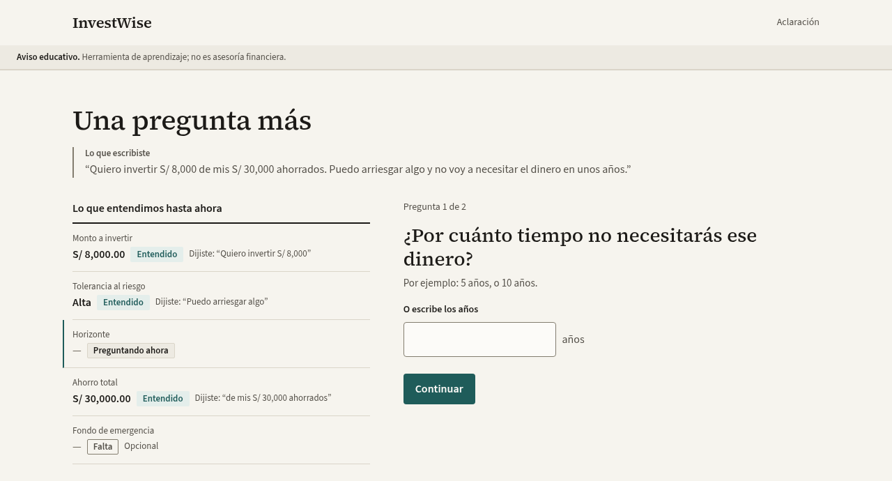

Si falta algún dato o lo dijiste de forma vaga, la aplicación te hace **una pregunta a la vez**:

- A la izquierda, **Lo que entendimos hasta ahora** muestra cada dato con su estado (**Entendido**, **Preguntando ahora**, **Falta** o **Supuesto**) y la frase tuya de la que salió ("Dijiste: …"). Así compruebas que se interpretó bien.
- Arriba de la pregunta verás cuántas quedan ("Pregunta 1 de 2").
- Responde eligiendo una opción o escribiendo un número, y pulsa **Continuar**.

En la figura anterior, el texto decía "no voy a necesitar el dinero en unos años". Expresiones como "en unos años", "más adelante", "algún día" o "cuando lo necesite" no indican un plazo, así que la aplicación lo pregunta en lugar de suponer uno. En cambio, "a corto plazo", "a mediano plazo" o "a largo plazo" sí se aceptan sin preguntar.

El texto exacto de las preguntas puede variar un poco según el modo en que corre la aplicación (con modelo de lenguaje o sin conexión), pero los datos que se piden son siempre los mismos:

| Pregunta | ¿Se puede omitir? | Si la omites |
|---|---|---|
| Monto a invertir | No | — |
| Tolerancia al riesgo (cómo te sentirías si tu inversión bajara 10 % en un año malo) | No | — |
| Horizonte | No | — |
| Ahorro total | Sí, con **Prefiero no responder** | Se asume una capacidad media para asumir pérdidas |
| Fondo de emergencia | Sí, con **Prefiero no responder** | Se asume una capacidad media para asumir pérdidas |

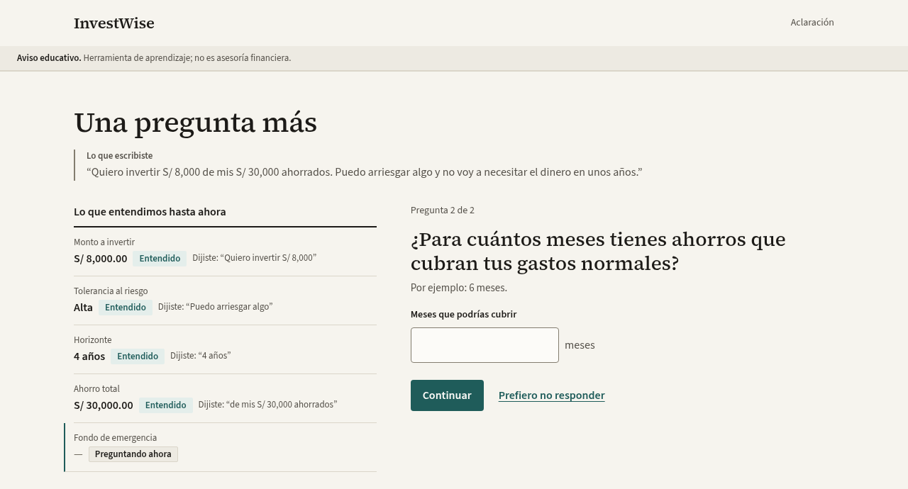

Solo las dos últimas preguntas tienen el botón **Prefiero no responder**, porque el monto, el riesgo y el horizonte son indispensables para calcular. Si omites cualquiera de las dos, la aplicación deja de usar ambos datos para estimar tu capacidad de absorber pérdidas y supone una capacidad **media**. Antes de calcular te lo avisa en el recuadro **Continuamos con un supuesto**; pulsa **Continuar con este supuesto** para seguir.

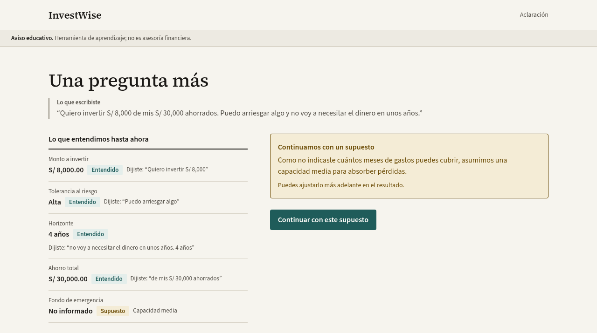

## 5. Lee el resultado

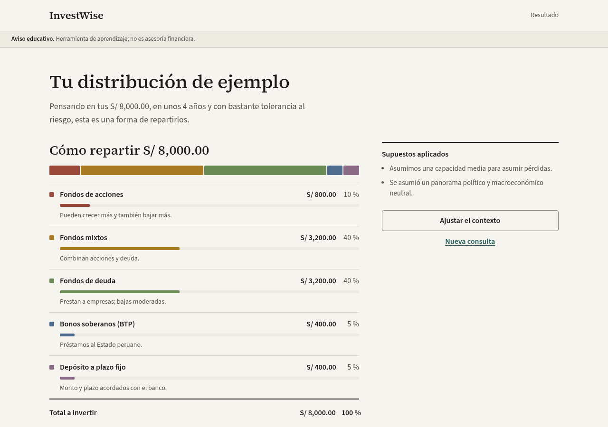

La pantalla **Tu distribución de ejemplo** empieza con un resumen de lo que entendió (monto, horizonte y tolerancia al riesgo) y tiene cuatro partes:

1. **Cómo repartir S/ …**: una barra de colores con el reparto y una fila por tipo de inversión con el monto en soles y el porcentaje. Los montos suman exactamente lo que vas a invertir (fila **Total a invertir**).
2. **Supuestos aplicados** (a la derecha): lo que la aplicación asumió porque no lo dijiste, por ejemplo una capacidad media para asumir pérdidas o un panorama político y macroeconómico neutral.
3. **Por qué esta distribución**: una explicación en lenguaje sencillo de cada parte del reparto, de cómo influyó tu horizonte y de tu capacidad para absorber pérdidas.
4. **Qué podría pasar en un año (estimado)**: tres escenarios en soles.
    - **En un año malo**: un resultado desfavorable pero posible; puede ser una pérdida.
    - **En un año normal**: el resultado esperado.
    - **En un año bueno**: un resultado favorable pero posible.

**Por qué cada categoría está entre 5 % y 40 %.** Ningún tipo de inversión recibe más del 40 %, para que tu dinero no quede concentrado en uno solo. Y ninguno recibe menos del 5 %, para que veas una parte en cada tipo de inversión en lugar de un 0 % sin explicación. Por eso, aunque seas muy cauteloso, verás un 5 % en acciones; y aunque busques mucha ganancia, el plazo fijo no desaparece.

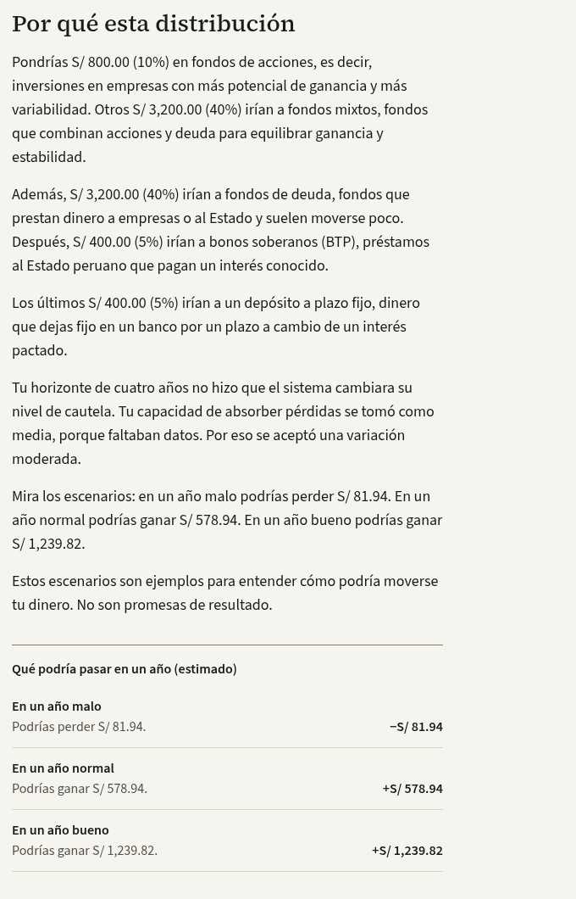

Los escenarios son estimaciones educativas, no promesas: un año real puede quedar fuera de ese rango.

## 6. Ajusta el contexto

Pulsa **Ajustar el contexto** (a la derecha del resultado) para ver cómo cambiaría el reparto según cómo veas el país. Hay dos factores, cada uno con tres niveles (**Adverso**, **Neutral**, **Favorable**):

| Factor | Qué representa |
|---|---|
| Panorama político | Cómo ves la estabilidad política del país en los próximos meses: elecciones, conflictos o cambios de reglas. |
| Estabilidad macroeconómica | Cómo ves la economía: inflación, tipo de cambio y crecimiento. |

Al elegir un nivel, la distribución se recalcula. A la derecha aparecen dos barras, **Antes (Neutral)** y **Después (ajustado)**, y una tabla con el **Cambio** en puntos porcentuales por tipo de inversión.

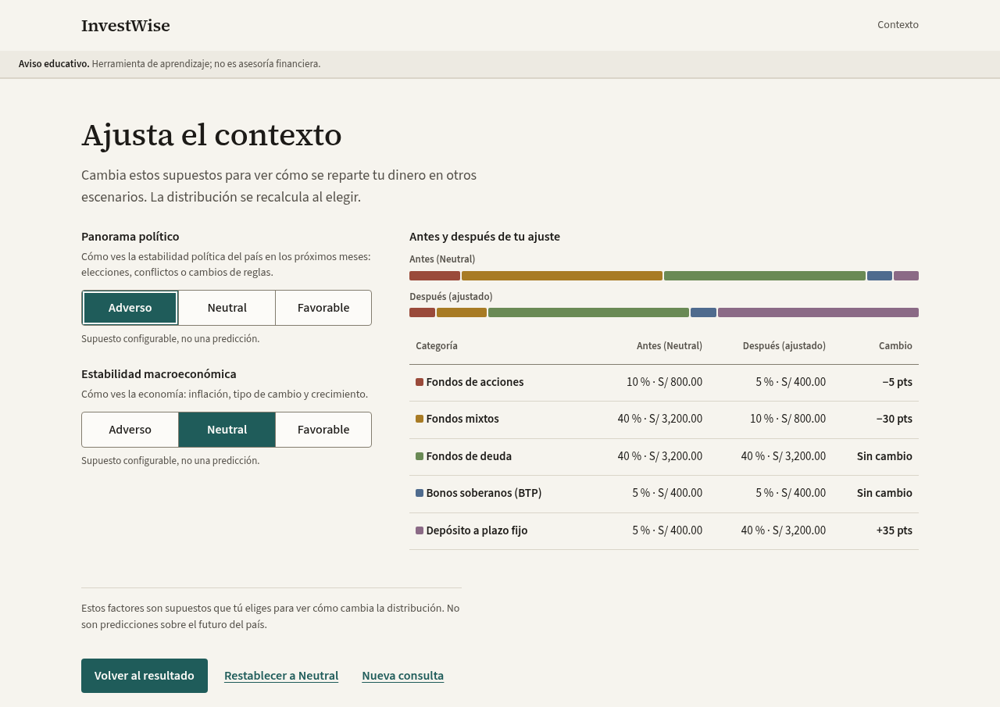

En la figura, un panorama político adverso pasa dinero de fondos de acciones (−5 puntos) y fondos mixtos (−30 puntos) al depósito a plazo fijo (+35 puntos), que es más estable.

Estos factores son supuestos que tú eliges para comparar, no predicciones. Los botones de esta pantalla son:

- **Volver al resultado**: regresa al resultado con el contexto elegido.
- **Restablecer a Neutral**: vuelve al punto de partida.
- **Nueva consulta**: vuelve a la pantalla de inicio para describir otra situación.

## 7. Empieza una nueva consulta

Pulsa **Nueva consulta**, debajo de **Ajustar el contexto** en el resultado o al pie del panel de contexto. Vuelves a la pantalla de inicio con el cuadro de texto vacío. Úsalo también para corregir un dato mal entendido: describe tu situación otra vez con el dato correcto.

## 8. Detalle técnico

Al final del resultado está **Ver detalle técnico** (*Para evaluación académica*). Está pensado para docentes, evaluadores y personas curiosas que quieren ver cómo se calculó el reparto. No necesitas abrirlo para usar la aplicación. Las figuras de esta sección corresponden al primer ejemplo de la sección 3 (S/ 5,000, poca tolerancia al riesgo, 3 años y 4 meses de fondo de emergencia).

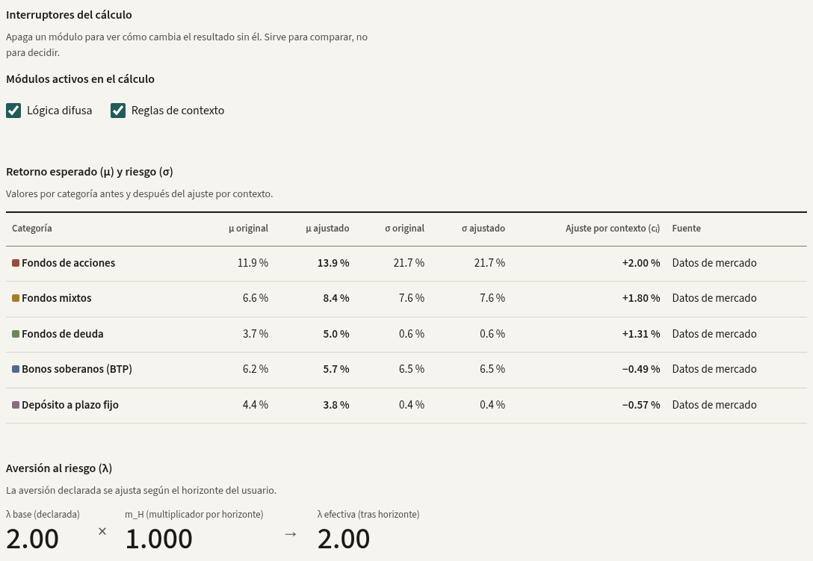

**Interruptores del cálculo.** Las casillas **Lógica difusa** y **Reglas de contexto** encienden o apagan esos módulos. Al apagar uno, el resultado se recalcula sin él. Sirve para comparar, no para decidir.

**Retorno esperado (μ) y riesgo (σ).** Por cada tipo de inversión: la ganancia anual esperada (μ) y su variabilidad (σ), antes y después del ajuste por contexto, el ajuste aplicado (cᵢ) y la **fuente**: **Datos de mercado** (series reales del BCRP y de la SBS) o **Valor de referencia** (un valor por defecto cuando no hay datos).

**Aversión al riesgo (λ).** Tu nivel de cautela declarado (**λ base**), el multiplicador por horizonte (**m_H**) y la cautela que usa el cálculo (**λ efectiva** = λ base × m_H). Un horizonte corto aumenta la cautela; uno largo la reduce.

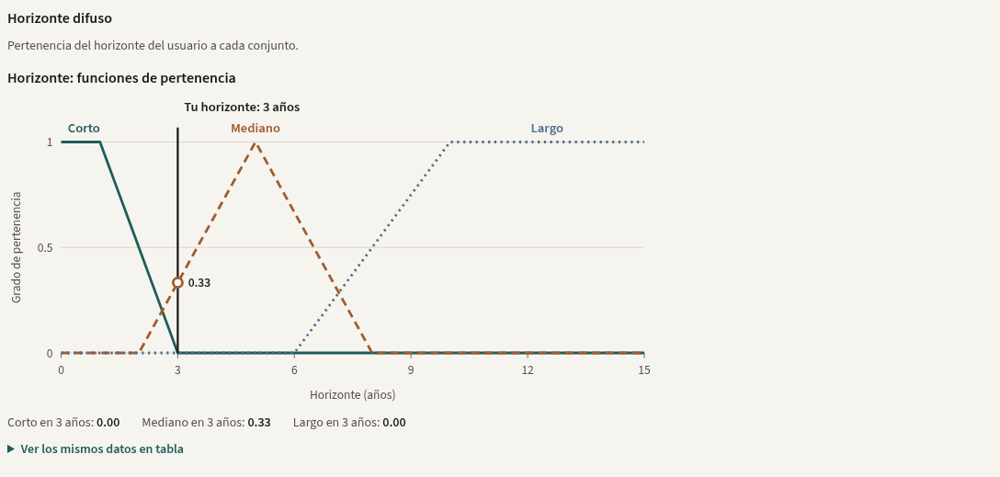

**Horizonte difuso.** Un gráfico con tres curvas (corto, mediano y largo) y una línea vertical en tu horizonte. Muestra en qué grado tu horizonte pertenece a cada grupo. En la figura, 3 años pertenece al grupo "mediano" con grado 0.33 y a los otros dos con grado 0.

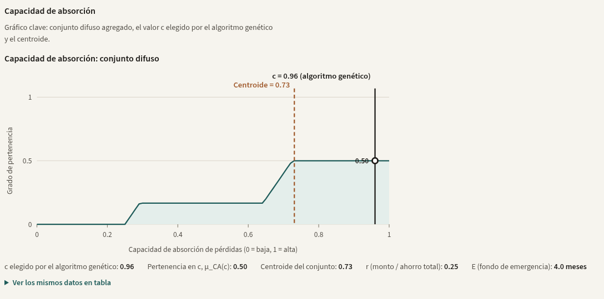

**Capacidad de absorción.** Es el gráfico clave del proyecto. La zona sombreada es el conjunto difuso de tu capacidad para absorber pérdidas (de 0 = baja a 1 = alta), calculado con la proporción que inviertes de tus ahorros (**r**) y tu fondo de emergencia (**E**). La línea discontinua es el **centroide** (el valor promedio del conjunto) y la línea sólida es **c**, el valor que eligió el algoritmo genético como parte de su solución. Que c y el centroide no coincidan es normal: el algoritmo puede elegir cualquier punto alto del conjunto. Si omitiste el ahorro total o el fondo de emergencia, el gráfico lo indica en un recuadro de supuesto.

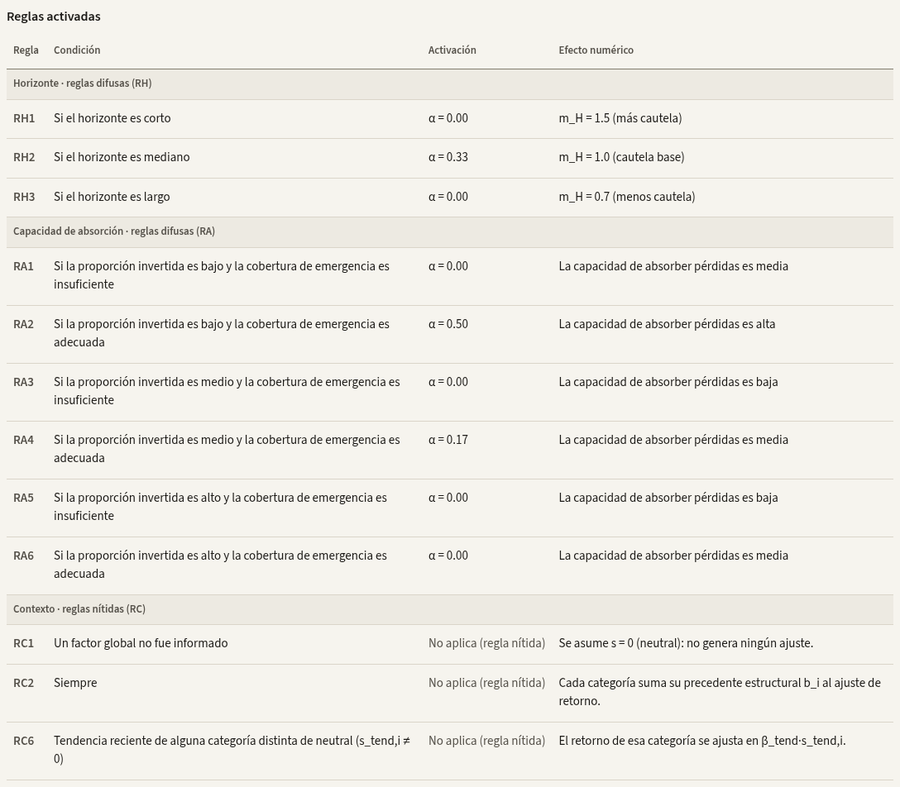

**Reglas activadas.** Cada regla con su condición, su grado de activación **α** (de 0 a 1; 0 significa que no se aplicó) y su efecto numérico. Las reglas de horizonte (RH) y de capacidad de absorción (RA) son difusas: se aplican en cierto grado. Las de contexto (RC) son nítidas: se aplican o no, por eso su activación dice *No aplica (regla nítida)*.

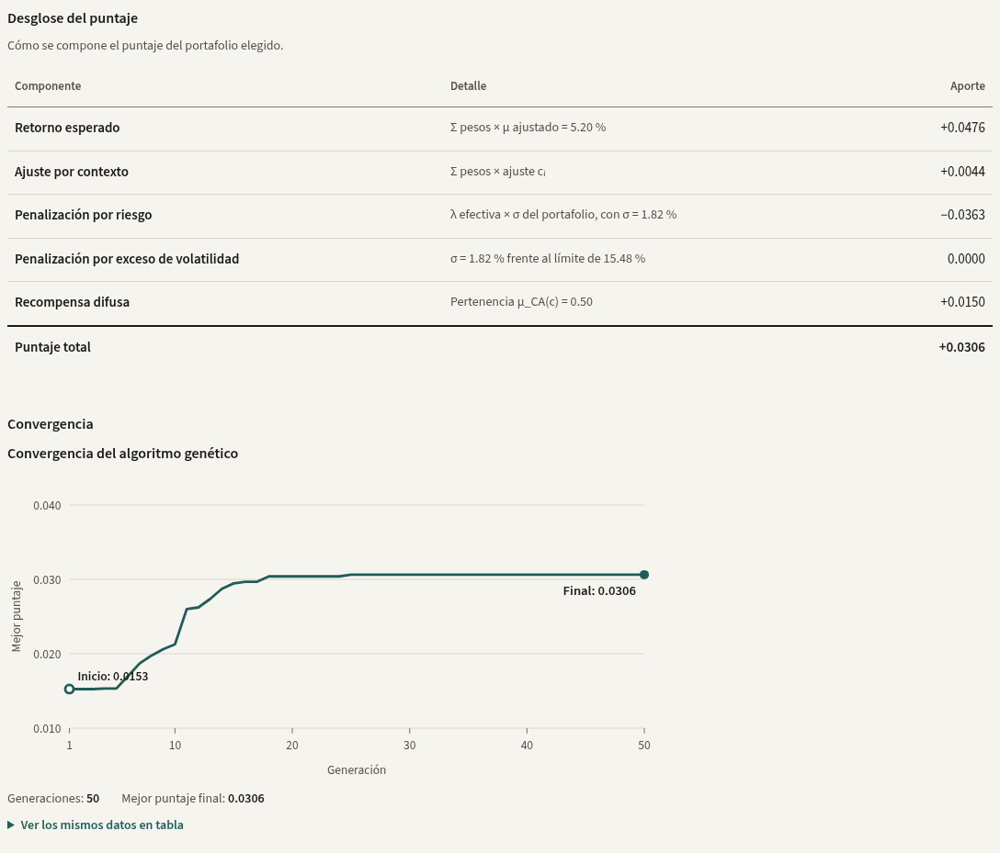

**Desglose del puntaje.** Cómo se compone el puntaje del portafolio elegido: retorno esperado, ajuste por contexto, penalización por riesgo, penalización por exceso de volatilidad y recompensa difusa. El **puntaje total** es la suma.

**Convergencia.** El mejor puntaje del algoritmo genético en cada generación. La curva sube y se aplana cuando el algoritmo deja de encontrar mejoras.

**Ver los mismos datos en tabla.** Cada gráfico tiene este enlace. Al pulsarlo se despliega una tabla con los valores exactos, útil para leerlos con precisión o con un lector de pantalla. El panel técnico sigue abierto mientras abres y cierras las tablas.

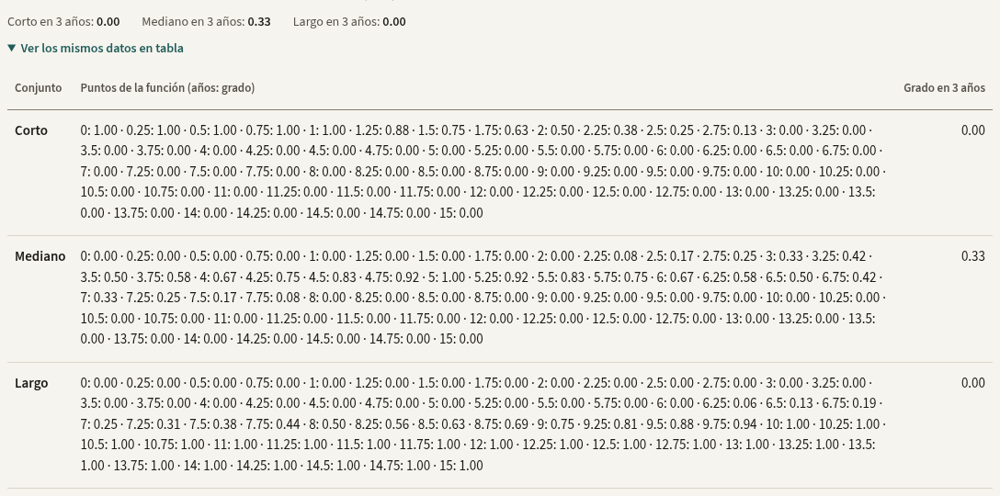

## 9. Tema claro u oscuro

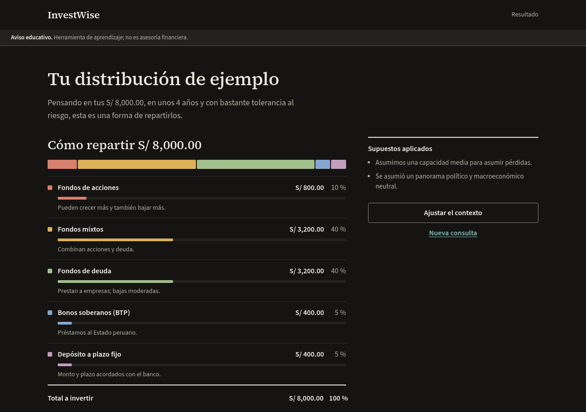

Al pie de cada pantalla está el enlace **Usar tema oscuro** (o **Usar tema claro**). La primera vez, la aplicación sigue la preferencia de tu sistema; después recuerda tu elección en ese navegador.

## 10. Indicador de modo sin conexión

Si en la cabecera aparece la etiqueta **Modo sin conexión** y debajo una franja amarilla con el texto *"Sin conexión a la API: se usa el generador local"*, el servidor está funcionando sin un modelo de lenguaje en línea. Todo sigue funcionando: el reparto se calcula con los mismos módulos y la explicación sale de una plantilla, que puede ser menos detallada. Las capturas de este manual se tomaron con el modelo de lenguaje activo, por eso no muestran esa franja.

## 11. En el celular

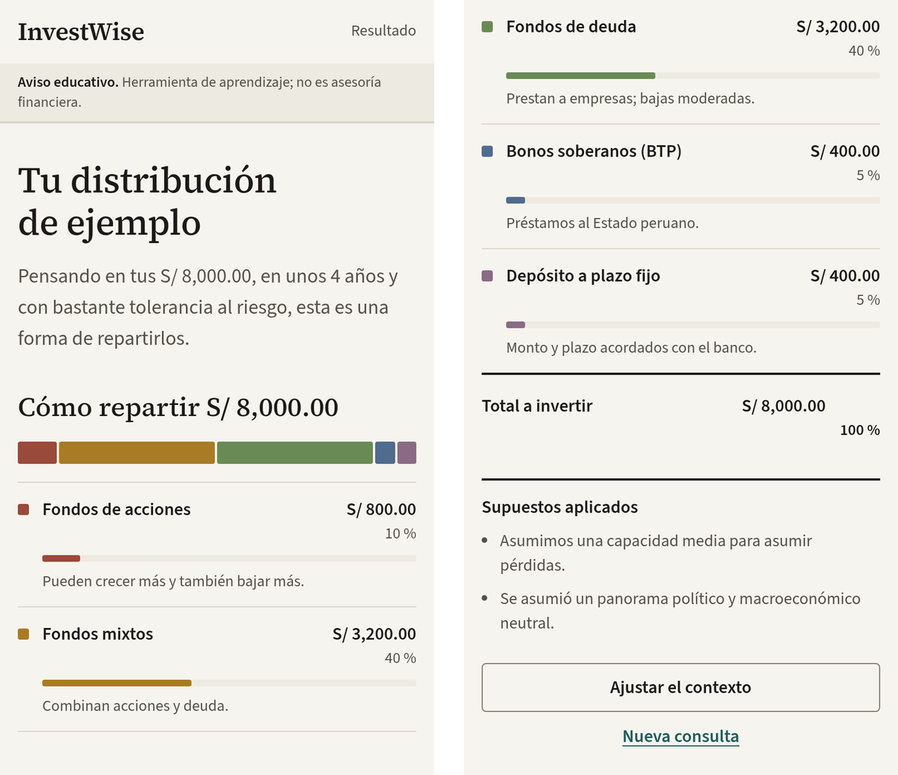

En pantallas pequeñas el contenido se apila en una sola columna: primero el reparto, luego los supuestos, los botones, la explicación y los escenarios. La captura corresponde a 390 px de ancho; para este manual, la pantalla se partió en dos columnas que se leen de izquierda a derecha.

## 12. Preguntas frecuentes

- **¿Por qué el resultado cambia un poco si vuelvo a empezar?** El algoritmo genético tiene una parte aleatoria. Dentro de una misma consulta se reutiliza la misma semilla, así que al ajustar el contexto solo cambia lo que tú cambiaste. Con **Nueva consulta** se usa una semilla nueva.
- **¿Puedo corregir un dato?** Sí: pulsa **Nueva consulta** y describe tu situación otra vez con el dato corregido.
- **¿Qué pasa si no quiero decir cuánto tengo ahorrado?** Pulsa **Prefiero no responder**. Se supone una capacidad media para asumir pérdidas y se indica en **Supuestos aplicados**.
- **¿Por qué ninguna categoría pasa del 40 % ni baja del 5 %?** Para que el reparto sea diversificado y para que veas una parte en cada tipo de inversión (sección 5).
- **¿Se guardan mis datos?** No. La aplicación no tiene cuentas ni base de datos; solo recuerda el tema elegido en tu navegador. Si el servidor usa un modelo de lenguaje en línea, tu texto se envía a ese proveedor para interpretarlo.
- **¿Puedo invertir directamente desde la aplicación?** No. InvestWise solo muestra un ejemplo educativo; no está conectada a bancos ni a fondos.

## 13. Glosario

| Término | Significado |
|---|---|
| Horizonte | Tiempo durante el cual no necesitarás el dinero invertido. |
| Tolerancia al riesgo | Cuánta variación de tu inversión aceptas sin incomodarte. |
| Fondo de emergencia | Ahorro que cubre tus gastos durante algunos meses si dejas de recibir ingresos. |
| Capacidad de absorción | Cuánto podrías soportar una pérdida sin afectar tu vida diaria; depende de tu ahorro total y tu fondo de emergencia. |
| Retorno esperado (μ) | Ganancia anual promedio que se espera de un tipo de inversión, según datos históricos. |
| Riesgo o volatilidad (σ) | Cuánto varía el resultado de un año a otro. Más volatilidad significa subidas y bajadas más grandes. |
| Diversificar | Repartir el dinero entre varios tipos de inversión para no depender de uno solo. |
| Punto porcentual (pts) | Diferencia entre dos porcentajes: pasar de 40 % a 10 % es una baja de 30 puntos. |
| Lógica difusa | Forma de razonar con grados ("algo largo", "bastante seguro") en lugar de solo sí o no. |
| Algoritmo genético | Método que prueba muchas combinaciones, conserva las mejores y las mezcla durante varias generaciones hasta encontrar un buen reparto. |
| Centroide | Valor promedio de un conjunto difuso; resume el conjunto en un solo número. |
| Supuesto | Valor que la aplicación usa cuando no diste un dato o para comparar escenarios; siempre se muestra. |
