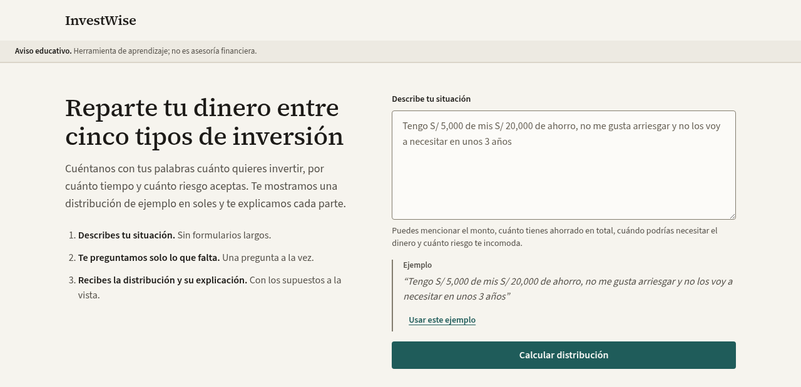
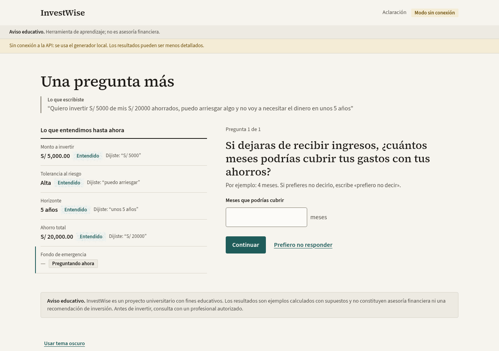
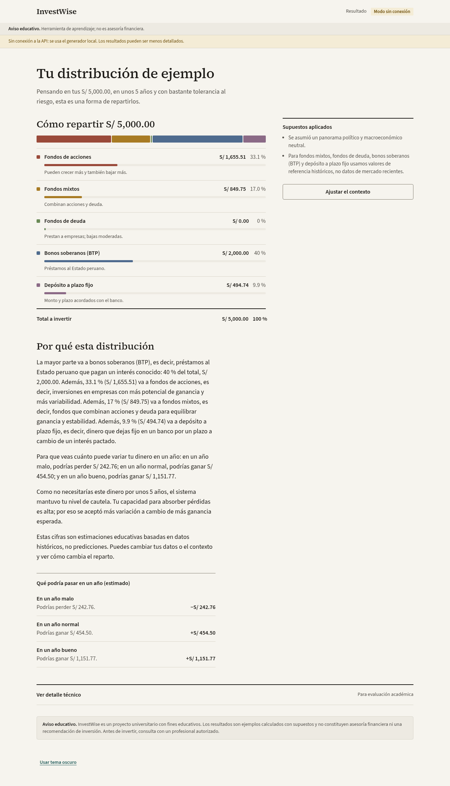
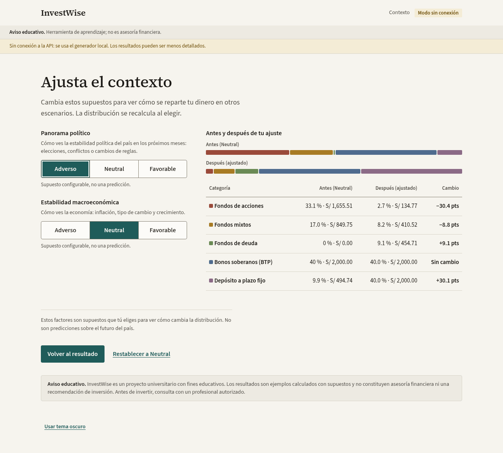
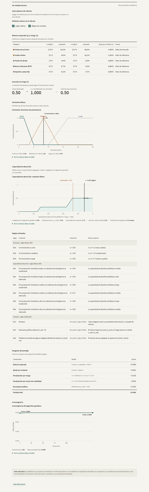
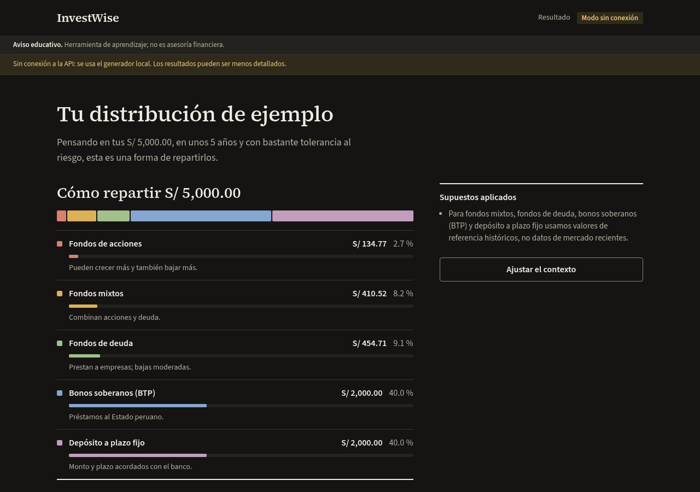
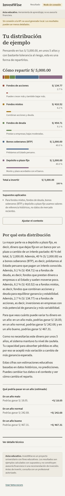

# Manual de usuario

Esta guía es para ti si quieres usar InvestWise y no tienes conocimientos de finanzas. No necesitas saber qué es un bono o una volatilidad: la aplicación te lo explica en el camino.

## 1. Qué hace y qué no hace

**Lo que hace.** Escribes con tus palabras tu situación y recibes una **distribución de ejemplo**: cuánto de tu dinero, en soles, pondrías en cada uno de cinco tipos de inversión, con una explicación sencilla y tres escenarios de lo que podría pasar en un año.

| Tipo de inversión | En pocas palabras |
|---|---|
| Fondos de acciones | Pueden crecer más y también bajar más. |
| Fondos mixtos | Combinan acciones y deuda. |
| Fondos de deuda | Prestan a empresas o al Estado; bajas moderadas. |
| Bonos soberanos (BTP) | Préstamos al Estado peruano con un interés conocido. |
| Depósito a plazo fijo | Dinero fijo en un banco por un plazo, a cambio de un interés pactado. |

**Lo que no hace.** No es asesoría financiera ni una recomendación personalizada. No compra ni vende nada, no se conecta a tu banco y no predice el futuro. Es un proyecto universitario con fines educativos: los resultados se calculan con supuestos y datos históricos. Antes de invertir, consulta con un profesional autorizado. Este aviso aparece siempre en la parte superior y al pie de cada pantalla.

## 2. Describe tu situación

En la pantalla de inicio escribe en el cuadro **Describe tu situación**. Mientras más de estos datos menciones, menos preguntas tendrás que responder:

| Dato | Por qué importa | Cómo decirlo |
|---|---|---|
| Monto a invertir | Es el dinero que se reparte | "S/ 5,000", "cinco mil soles" |
| Tolerancia al riesgo | Define cuánta variación aceptas | "no me gusta arriesgar", "puedo arriesgar algo" |
| Horizonte | Cuánto tiempo no necesitarás el dinero | "en 3 años", "a largo plazo" |
| Ahorro total | Qué parte de tus ahorros estás invirtiendo | "de mis S/ 20,000" |
| Fondo de emergencia | Cuántos meses podrías cubrir tus gastos sin ingresos | "tengo 4 meses de colchón" |

Ejemplos:

- "Tengo S/ 5,000 de mis S/ 20,000 de ahorro, no me gusta arriesgar y no los voy a necesitar en unos 3 años; tengo 4 meses de colchón."
- "Quiero invertir S/ 5000 de mis S/ 20000 ahorrados, puedo arriesgar algo y no voy a necesitar el dinero en unos 5 años."
- "Quiero invertir 10 mil soles a largo plazo y busco la máxima ganancia."

Si no sabes qué escribir, pulsa **Usar este ejemplo**. Luego pulsa **Calcular distribución**.

## 3. Responde las preguntas de aclaración

Si falta algún dato, la aplicación te hace **una pregunta a la vez**:

- A la izquierda, **Lo que entendimos hasta ahora** muestra cada dato, si fue entendido y la frase tuya de la que salió ("Dijiste: …"). Así puedes comprobar que se interpretó bien.
- Arriba de la pregunta verás su número ("Pregunta 1 de 1").
- Responde con una opción o escribiendo un número, y pulsa **Continuar**.

| Pregunta | ¿Se puede omitir? | Si la omites |
|---|---|---|
| Monto a invertir | No | — |
| Tolerancia al riesgo (cómo te sentirías si tu inversión bajara 10 % en un año malo) | No | — |
| Horizonte | No | — |
| Ahorro total | Sí, con **Prefiero no responder** | Se asume una capacidad media para asumir pérdidas |
| Fondo de emergencia | Sí, con **Prefiero no responder** | Se asume una capacidad media para asumir pérdidas |

Cuando la aplicación continúa con un supuesto, te lo muestra en un recuadro **Continuamos con un supuesto** y lo vuelve a listar en el resultado, en **Supuestos aplicados**.

## 4. Lee el resultado

La pantalla **Tu distribución de ejemplo** tiene cuatro partes:

1. **Cómo repartir S/ …**: una barra de colores con el reparto y una fila por tipo de inversión con el monto en soles y el porcentaje. Los montos suman exactamente lo que vas a invertir (fila **Total a invertir**). Cada categoría recibe entre 5 % y 40 %: ninguna pasa del 40 %, para que el dinero no quede concentrado, y ninguna queda en 0 %, para que veas una parte en cada tipo de inversión.
2. **Supuestos aplicados**: lo que la aplicación asumió porque no lo dijiste (por ejemplo, un panorama político neutral) y qué categorías usan valores de referencia históricos en lugar de datos de mercado recientes.
3. **Por qué esta distribución**: una explicación en lenguaje sencillo de cada parte del reparto, de cómo influyó tu horizonte y de tu capacidad para absorber pérdidas.
4. **Qué podría pasar en un año (estimado)**: tres escenarios en soles.
   - **Año malo**: un resultado desfavorable pero posible; puede ser una pérdida.
   - **Año normal**: el resultado esperado.
   - **Año bueno**: un resultado favorable pero posible.

Estos escenarios son estimaciones educativas, no promesas: un año real puede quedar fuera de ese rango.

Para hacer otra consulta, pulsa **Nueva consulta** (debajo de **Ajustar el contexto**): vuelves a la pantalla de inicio con el cuadro de texto vacío.

## 5. Ajusta el contexto

Pulsa **Ajustar el contexto** para ver cómo cambiaría el reparto según cómo veas el país. Hay dos factores, cada uno con tres niveles (**Adverso**, **Neutral**, **Favorable**):

| Factor | Qué representa |
|---|---|
| Panorama político | Cómo ves la estabilidad política en los próximos meses: elecciones, conflictos o cambios de reglas. |
| Estabilidad macroeconómica | Cómo ves la economía: inflación, tipo de cambio y crecimiento. |

Al elegir un nivel, la distribución se recalcula. A la derecha verás **Antes** (con contexto neutral) y **Después** (con tu ajuste), y una tabla con el **Cambio** en puntos porcentuales por tipo de inversión. En la captura, un panorama político adverso pasa dinero de acciones y fondos mixtos a deuda y plazo fijo, que son más estables.

Estos factores son supuestos que tú eliges para comparar, no predicciones. **Restablecer a Neutral** vuelve al punto de partida, **Volver al resultado** te lleva al resultado con el contexto elegido y **Nueva consulta** vuelve a la pantalla de inicio para describir otra situación.

## 6. Detalle técnico

Al final del resultado está **Ver detalle técnico**. Está pensado para docentes, evaluadores y personas curiosas que quieren ver cómo se calculó el reparto. No necesitas abrirlo para usar la aplicación.

| Sección | Qué muestra |
|---|---|
| Interruptores del cálculo | Casillas **Lógica difusa** y **Reglas de contexto**. Al apagar una, el resultado se recalcula sin ese módulo. Sirve para comparar, no para decidir. |
| Retorno esperado (μ) y riesgo (σ) | Por cada tipo de inversión: ganancia anual esperada y variabilidad, antes y después del ajuste por contexto, y si vienen de datos de mercado o de valores de referencia. |
| Aversión al riesgo (λ) | Tu nivel de cautela declarado (λ base), el multiplicador por horizonte (m_H) y la cautela efectiva que usa el cálculo. Un horizonte corto aumenta la cautela; uno largo la reduce. |
| Horizonte difuso | Gráfico con tres curvas (corto, mediano, largo) y una línea vertical en tu horizonte. Muestra en qué grado tu horizonte pertenece a cada grupo: por ejemplo, 5 años es "mediano" al 100 %. |
| Capacidad de absorción | El conjunto difuso de tu capacidad para absorber pérdidas (zona sombreada, de 0 = baja a 1 = alta), calculado con tu proporción invertida (r) y tu fondo de emergencia. La línea discontinua es el **centroide** (el valor promedio del conjunto) y la línea sólida es **c**, el valor que eligió el algoritmo genético. Que `c` y el centroide no coincidan es normal: el algoritmo puede elegir cualquier punto de la zona más alta del conjunto. |
| Reglas activadas | Cada regla con su condición, su grado de activación **α** (de 0 a 1; 0 significa que no se aplicó) y su efecto. Las reglas de horizonte (RH) y de absorción (RA) son difusas; las de contexto (RC) son nítidas: se aplican o no. |
| Desglose del puntaje | Cómo se compone el puntaje del portafolio elegido: retorno esperado, ajuste por contexto, penalización por riesgo, penalización por exceso de volatilidad y recompensa difusa. El puntaje total es la suma. |
| Convergencia | El mejor puntaje del algoritmo genético en cada generación. La curva sube y se aplana cuando el algoritmo deja de encontrar mejoras. |

Cada gráfico tiene un enlace **Ver los mismos datos en tabla** para leer los valores exactos.

## 7. Tema claro u oscuro

Al pie de cada pantalla está el enlace **Usar tema oscuro** (o **Usar tema claro**). La aplicación recuerda tu elección en ese navegador.

## 8. Indicador de modo sin conexión

Si en la cabecera aparece la etiqueta **Modo sin conexión** y una franja amarilla, la aplicación está usando su generador local en lugar de un modelo de lenguaje en línea. Todo funciona igual: el reparto se calcula con los mismos módulos y la explicación sale de una plantilla, que puede ser menos detallada. Las capturas de este manual se tomaron en ese modo.

## 9. En el celular

En pantallas pequeñas el contenido se apila en una sola columna: primero el reparto, luego los supuestos, la explicación y los escenarios. La captura corresponde a 390 px de ancho, después de elegir un panorama político adverso.

## 10. Preguntas frecuentes

- **¿Por qué el resultado cambia un poco si vuelvo a empezar?** El algoritmo genético tiene una parte aleatoria. Dentro de una misma sesión se reutiliza la misma semilla, así que al ajustar el contexto solo cambia lo que tú cambiaste.
- **¿Puedo corregir un dato?** Pulsa **Nueva consulta** en el resultado o en la pantalla de contexto para volver a la pantalla de inicio y describe tu situación otra vez con el dato corregido. Las capturas de esta guía son anteriores a ese botón.
- **¿Se guardan mis datos?** No. La aplicación no tiene cuentas ni base de datos; solo recuerda el tema elegido en tu navegador.
